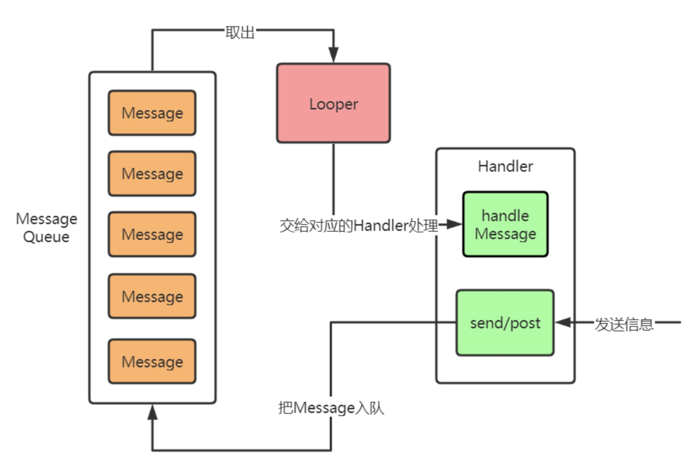
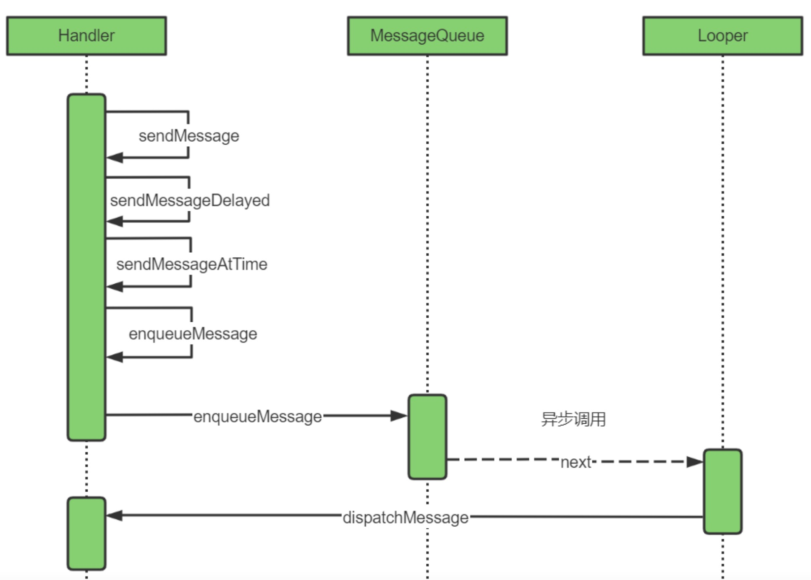
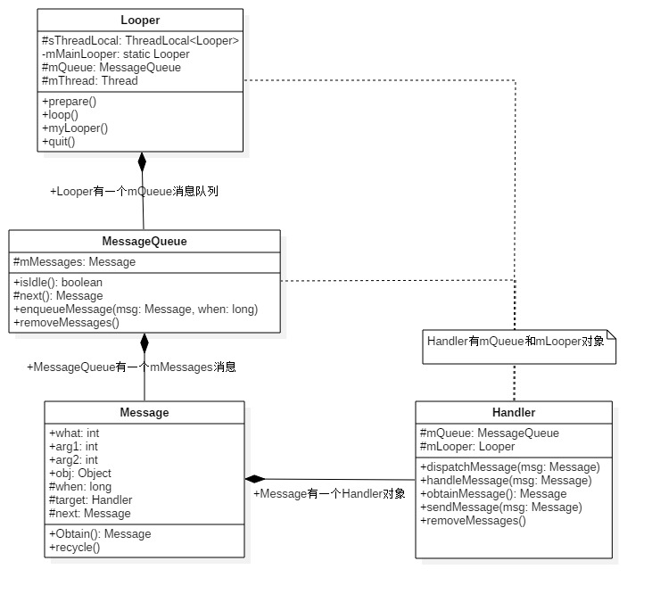

## Handler

#### 1 什么是Handler
Android消息处理机制，负责消息的分发和处理

#### 2 Handler的作用

- **to schedule messages and runnables to be executed at some point in the future**
调度消息和runnables在未来某个时间点执行
 

- **to enqueue an action to be performed on a different thread than your own**
在其他线程执行入队的任务
 

#### 3 消息机制流程

#### 4 Handler如何实现线程间通讯

由于工作线程与主线程共享地址空间，即Handler实例对象mHandler位于线程间共享的内存堆上，工作线程与主线程都能直接使用该对象