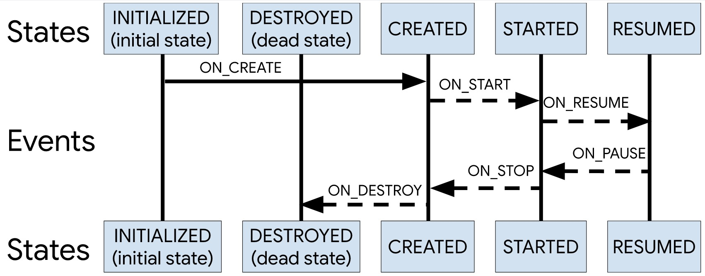

## Lifecycles

生命周期感知型组件，通过观察者模式来响应生命周期组件的生命周期。

```kotlin
class MyObserver : DefaultLifecycleObserver {
    override fun onResume(owner: LifecycleOwner) {
        connect()
    }

    override fun onPause(owner: LifecycleOwner) {
        disconnect()
    }
}

myLifecycleOwner.getLifecycle().addObserver(MyObserver())
```

