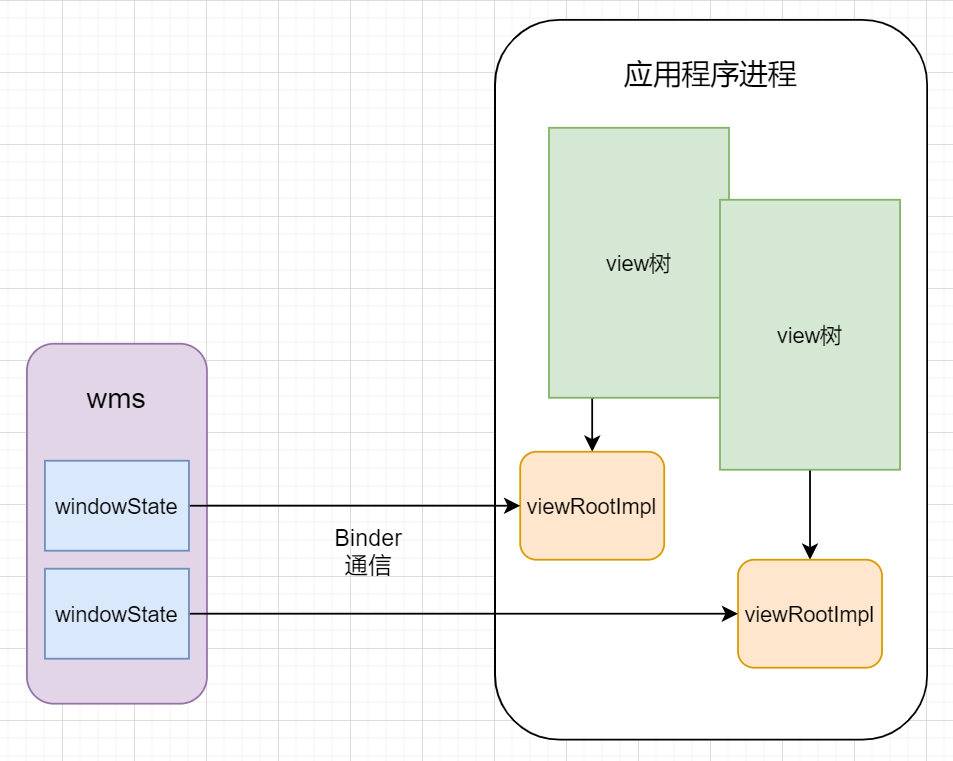
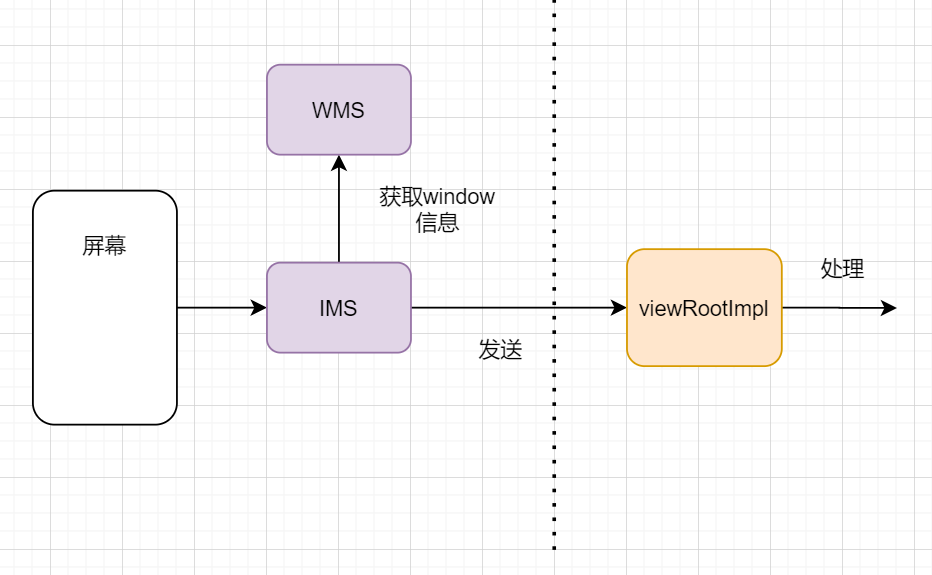
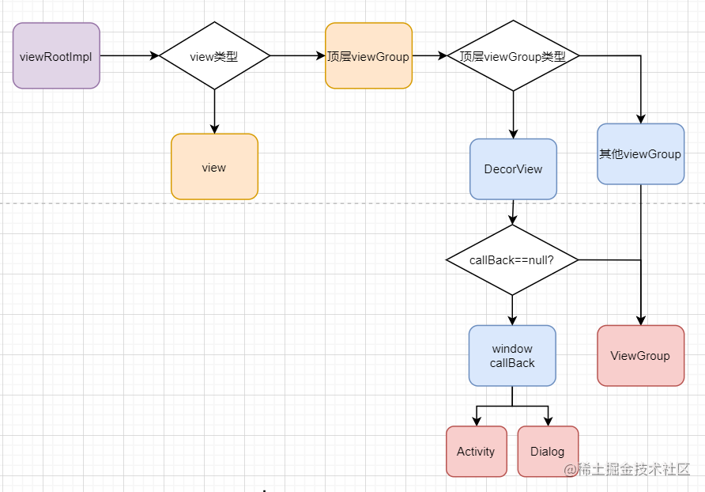
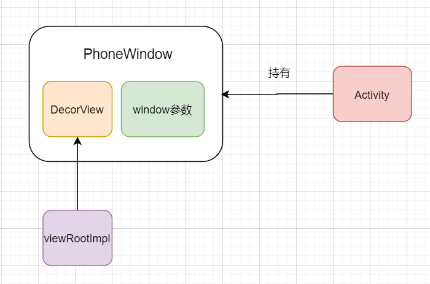
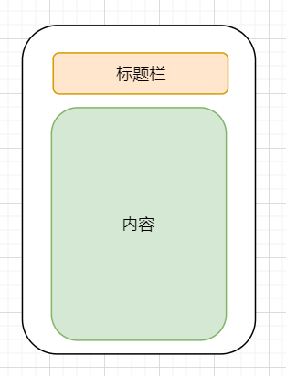
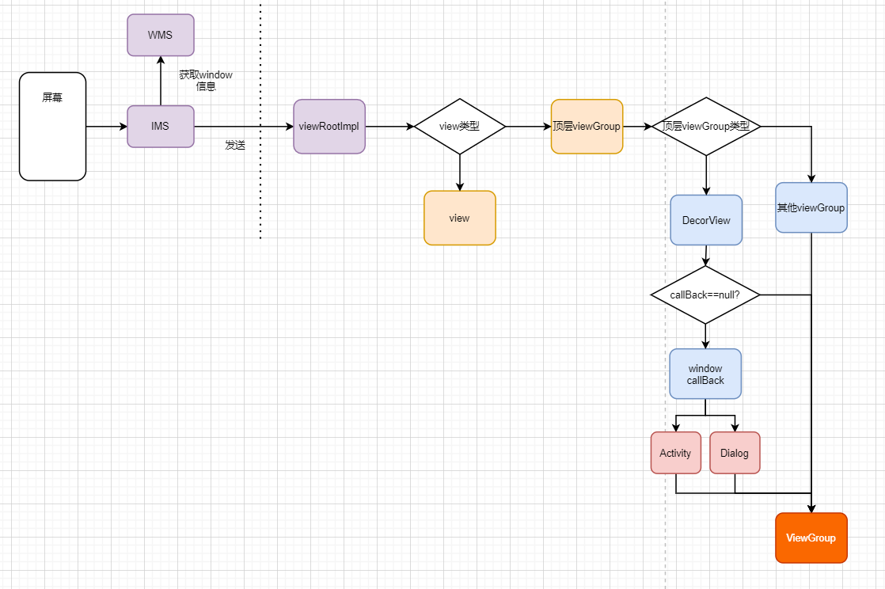
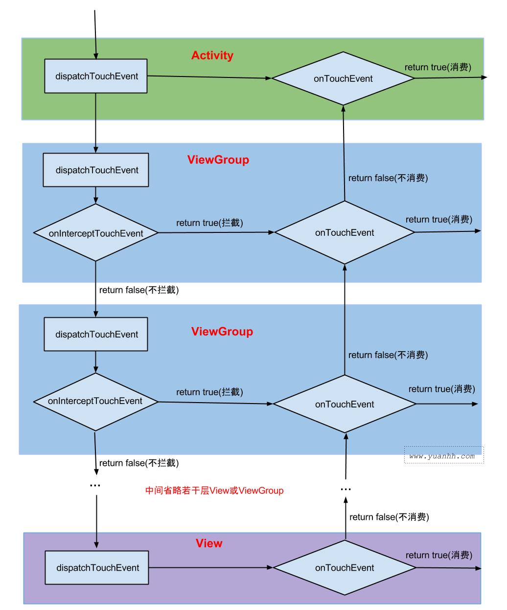

#### 1 整体流程
**ViewRootImpl**

每一棵view树都有一个根，叫做ViewRootImpl ，他负责管理这整一棵view树的绘制、事件分发等

**触摸信息是如何到达viewRootImpl的**

**viewRootImpl对事件的分发流程**
viewRootImpl管理一棵view树，view树的最外层是viewGroup, 而viewGroup继承于view。因此整一棵view树，从外部可以看做一个view。viewRootImpl接收到触摸信息之后，经过处理之后，封装成MotionEvent对象发送给他所管理的view，由view自己进行分发，分发的方法是dispatchTouchEvent

触摸事件一定是从Activity开始的吗？不是,Activity只是其中的一种情况，只有Activity自己负责的那一棵view树，才一定会到达activity，而其他的window，则不会经过Activity。触摸事件是从viewRootImpl开始，而不是Activity
 

**phonewindow**

我们的Activity布局，就被添加到内容栏中，属于DecorView控件树的一部分。这样Activity可以通过PhoneWindow，间接管理自身的界面，把window相关的操作都托管给PhoneWindow，减轻自身负担
 

**DecorView**

DecorView交给Activity处理，Activity直接交给PhoneWindow处理，PhoneWindow直接交给其内部的DecorView处理，而DecorView则直接调用父类ViewGroup的方法进行分发
 

**整体流程**

- IMS从系统底层接收到事件之后，会从WMS中获取window信息，并将事件信息发送给对应的viewRootImpl
- viewRootImpl接收到事件信息，封装成motionEvent对象后，发送给管理的view
- view会根据自身的类型，对事件进行分发还是自己处理
- 顶层viewGroup一般是DecorView，DecorView会根据自身callBack的情况，选择调用callBack或者调用父类ViewGroup的方法
- 而不管顶层viewGroup的类型如何，最终都会到达ViewGroup对事件进行分发
 

#### 2 事件分发

**MotionEvent**

- ACTION_DOWN: 表示手指按下屏幕
- ACTION_MOVE: 手指在屏幕上滑动时，会产生一系列的MOVE事件
- ACTION_UP: 手指抬起，离开屏幕
- ACTION_CANCEL：当出现异常情况事件序列被中断，会产生该类型事件
- ACTION_POINTER_DOWN: 当已经有一个手指按下的情况下，另一个手指按下会产生该事件
- ACTION_POINTER_UP: 多个手指同时按下的情况下，抬起其中一个手指会产生该事件

**事件分发流程**

> 一个触控点的事件序列只能给一个view消费，除非发生异常情况如被viewGroup拦截，但同时注意事件序列是可以被viewGroup的onInterceptTouchEvent中断的

 
#### 参考链接
[Android事件分发机制二](https://qwerhuan.gitee.io/2021/01/22/android/android-shi-jian-fen-fa-ji-zhi-er-viewgroup-yu-view-dui-shi-jian-de-chu-li/)
