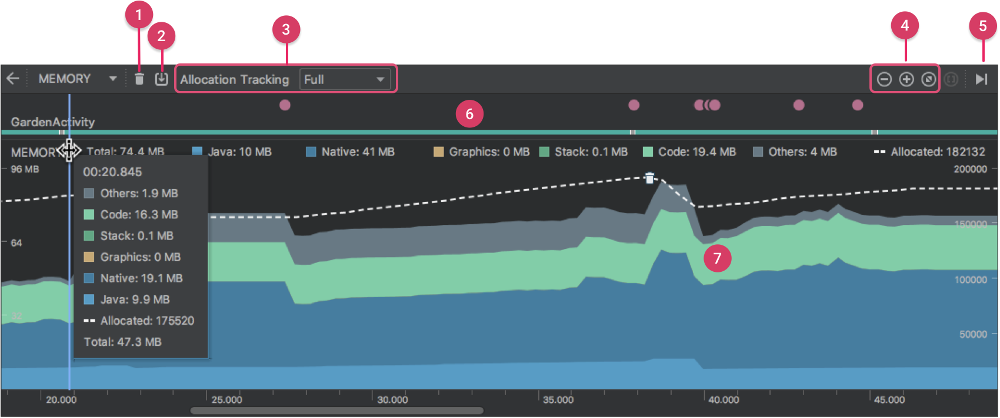
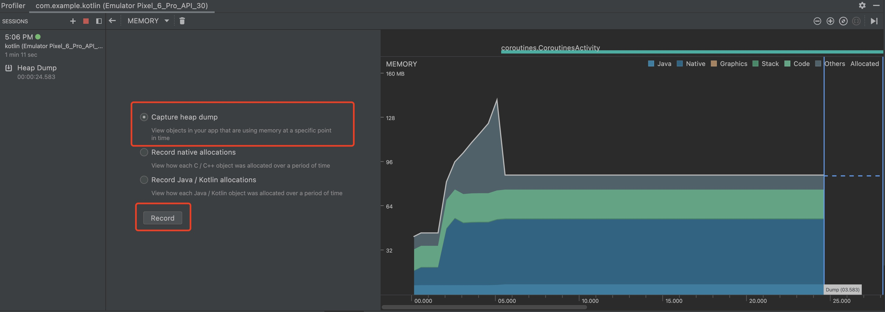
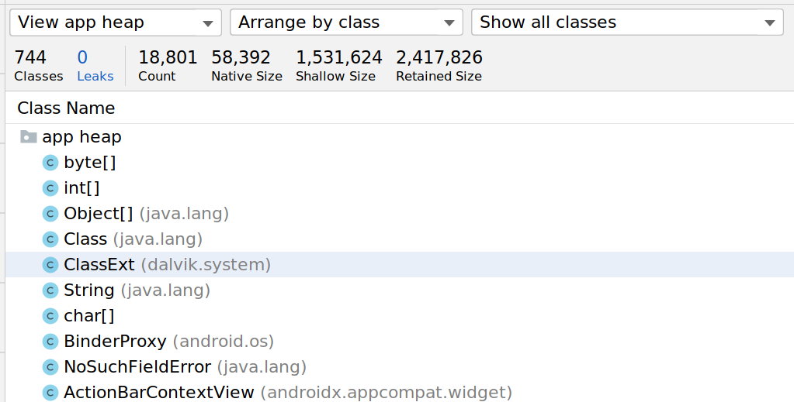

#### 1 概念
内存泄漏(Memory Leak)是指程序中已动态分配的堆内存由于某种原因程序未释放或无法释放，造成系统内存的浪费，导致程序运行速度减慢甚至内存溢出

- 忘记释放分配的内存
- 当应用不再需要这个对象，当仍未释放该对象的所有引用


#### 2 常见的发生内存泄露的地方

- **Context**
  比如Activity的Context，就包含大量的内存引用，一旦泄漏了Context，也意味泄漏它指向的所有对象
<br>

- **Bitmap没调用recycle()**
<br>

- **注册没取消造成的内存泄露**
<br>

- **资源对象没关闭造成的内存泄露**
  资源性对象比如（Cursor，File文件等）往往都用了一些缓冲，我们在不使用的时候，应该及时关闭它们，以便它们的缓冲及时回收内存
<br>  

- **WebView内存泄露**
  Activity.onDestroy时将 WebView 从 View 树中移除

    ```java
    override fun onDestroy() {
        val parent = webView?.parent
        if (parent is ViewGroup) {
            parent.removeView(webView)
        }
        webView?.destroy()
        super.onDestroy()
    }
    ```  
    > WebView 中的内存泄漏其实与 Chromium 内核版本有关，在新版本的 Chromium 内核中内存泄漏问题已经被解决了，而且从 Android 5.0(Lollipop) 版本开始将 Chromium WebView 迁移到了一个独立的 APP – Android System WebView，随着 Android System WebView 的独立发布，低版本 Android 系统(Android 5以上)上搭载的 Chromium 内核一般来说也不会太旧，所以出现内存泄漏的概率应该是比较小的。如果仍需要兼容这很小的一部分机型，可以通过文章开头的方式销毁 WebView，即先移除 WebView 组件，确保先调用到 onDetachedFromWindow 方法解注册，然后再通过 WebView.destroy 方法处理其它销毁逻辑。

<br>

#### 3 内存泄露检测

**android studio profiler工具检测**

1 依次点击 View > Tool Windows > Profiler（您也可以点击工具栏中的 Profile 图标 ）。<br>

2 从 Android Profiler 工具栏中选择要分析的设备和应用进程。如果您已通过 USB 连接设备但系统未列出该设备，请确保您已启用 USB 调试。<br>
3 点击 MEMORY 时间轴上的任意位置以打开内存分析器<br>



堆转储显示在您捕获堆转储时您的应用中哪些对象正在使用内存。特别是在长时间的用户会话后，堆转储会显示您认为不应再位于内存中却仍在内存中的对象，从而帮助识别内存泄漏



Leaks展示内存泄露情况

<br>

**LeakCanary**
A memory leak detection library for Android.