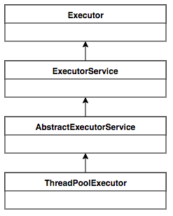
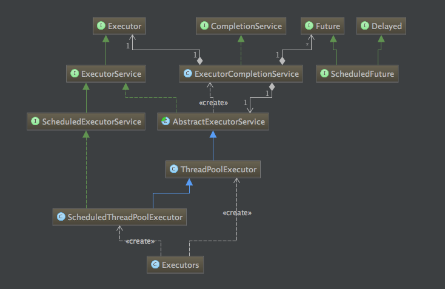
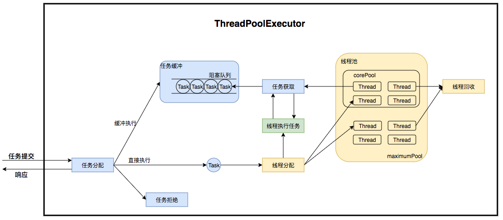
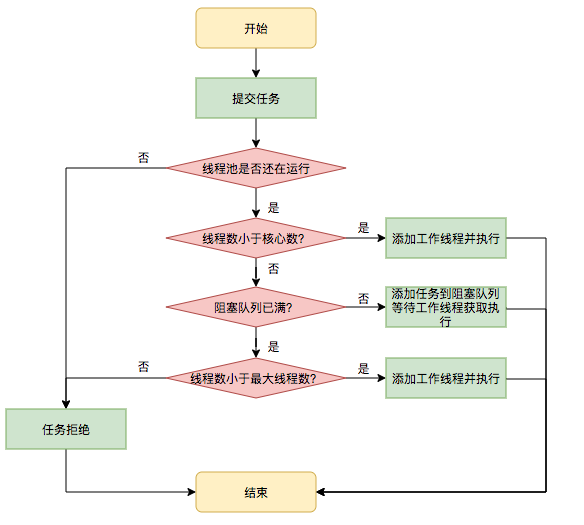

#### 1 进程
进程是具有一定独立功能的程序在某个数据集合上的一次运行活动，是系统进行资源分配和调度的一个独立单位

静态角度看，进程由以下几部分组成
- 程序
- 数据
- 进程控制块（PCB）

五种状态进程模型
- 运行状态
- 就绪状态
- 阻塞状态
- 创建状态
- 结束状态

#### 2 线程
线程是进程中的一个实体，是处理器调度和分派的基本单位

引入线程的好处
- 创建线程花费时间少，不需要另行分配资源
- 线程间切换时间少
- 同一个进程内的线程共享内存和文件，所以线程间通信无需调用内核，通信相比进程更简便，更快
- 线程能独立执行，能充分利用和发挥处理器的并行工作能力

#### 3 进程和线程的区别
- 线程作为调度和分派的基本单位，进程作为资源拥有的基本单位，从而使传统进程的两个属性分开，分来的结果是线程能够轻装运行，从而显著提高系统的并发程度

#### 4 进程间通信
- 共享内存
  在相互通信的进程间设有一个公共内存区，一组进程写，一组进程读
  <br>
- 消息机制
  1 消息缓冲通信，内存中开辟若干消息缓冲区 
  2 信箱通信
  <br>
- 管道通信
  Pipe，所谓管道就是连接两个进程之间的一个打开的共享文件，一端读一端写，管道通信具有传送数据量大的优点，但通信速度较慢
  <br>


#### 5 创建线程的方式

- 继承Thread类，重写run方法
- 实现Runnable接口，重写run方法
- 实现Callable接口，重写call方法
```java
private void startThread(){
    //第一种：继承Thread重写run方法
    new MyThread().start();
    //第二种：实现Runnable重写run方法
    new Thread(new MyRunanble()).start();
    //第三种：实现Callable重写call方法
    FutureTask<Integer> ft = new FutureTask<Integer>(new MyCallable());
    new Thread(ft).start();

}

class MyThread extends Thread{
    @Override
    public void run() {
        MLog.e(this.getClass().getName());
    }
}

class MyRunanble implements Runnable{

    @Override
    public void run() {
        MLog.e(this.getClass().getName());
    }
}

class MyCallable implements Callable {
    @Override
    public Object call() throws Exception {
        MLog.e(this.getClass().getName());
        return null;
    }
}
```

#### 6 线程池

**线程池是什么**

线程池（Thread Pool）是一种基于池化思想管理线程的工具

使用线程池的好处
- **降低资源消耗**
  通过池化技术重复利用已创建的线程，降低线程创建和销毁造成的损耗
  <br>

- **提高响应速度**
  任务到达时，无需等待线程创建即可立即执行
  <br>

- **提高线程的可管理性**
  线程是稀缺资源，如果无限制创建，不仅会消耗系统资源，还会因为线程的不合理分布导致资源调度失衡，降低系统的稳定性。使用线程池可以进行统一的分配、调优和监控
  <br>

- **提供更多更强大的功能**
  线程池具备可拓展性，允许开发人员向其中增加更多的功能。比如延时定时线程池ScheduledThreadPoolExecutor，就允许任务延期执行或定期执行

**线程池解决了什么问题**

线程池解决的核心问题就是资源管理问题

- 频繁申请/销毁资源和调度资源，将带来额外的消耗，可能会非常巨大
- 对资源无限申请缺少抑制手段，易引发系统资源耗尽的风险
- 系统无法合理管理内部的资源分布，会降低系统的稳定性
<br>

**类图**
<br>


<br>


<br>
**ThreadPoolExecutor运行流程**
<br>

<br>

**任务调度流程**
<br>

<br>

**线程池参数**

- corePoolSize
  核心线程数：是指线程池中长期存活的线程数
<br>

- maximumPoolSize
  最大线程数：线程池允许创建的最大线程数量，当线程池的任务队列满了之后，可以创建的最大线程数
<br>

- keepAliveTime
  空闲线程存活时间，当线程池中没有任务时，会销毁一些线程，销毁的线程数=maximumPoolSize（最大线程数）-corePoolSize（核心线程数）
<br>

- TimeUnit
  时间单位：空闲线程存活时间的描述单位
<br>

- BlockingQueue
  阻塞队列：线程池存放任务的队列，用来存储线程池的所有待执行任务
<br>

- ThreadFactory
  线程工厂：线程池创建线程时调用的工厂方法，通过此方法可以设置线程的优先级、线程命名规则以及线程类型（用户线程还是守护线程）等  
<br>

- RejectedExecutionHandler
  拒绝策略：当线程池的任务超出线程池队列可以存储的最大值之后，执行的策略
<br>


<br>

线程池核心参数corePoolSize、maximumPoolSize，workQueue，它们最大程度地决定了线程池的任务分配和线程分配策略，参数配置不合理会引发故障

- 最大核心数设置偏小，大量抛出RejectedExecutionException
- 由于队列设置过长，最大线程数设置失效，导致请求数量增加时，大量任务堆积在队列中，任务执行时间过长，最终导致下游服务的大量调用超时失败
<br>

**常见线程池类型**

- newFixedThreadPool
  线程池中的线程数量是固定的，核心线程数等于最大线程数，超出这个数量的线程就需要在队列中等待
<br>

- newSingleThreadExecutor
  只有一个线程，核心线程数和最大线程数都是1
<br>

- newCachedThreadPool
  核心线程数为0，最大线程数为MAX_VALUE，每个线程的存活时间是60秒，使用了SynchronousQueue
<br> 

- newScheduledThreadPool
  可以用来处理延时任务或者定时任务
<br>  

#### 7 AsyncTask
一个轻量级的异步任务库，封装了线程池和Handler，主要为我们在子线程中更新UI提供便利。现在已废弃Android 11(API 30) 
<br>

废弃原因
AsyncTask本意是使得UI线程的使用变得简单正确，但最常见的用法是集成到UI中，反而导致了 Context泄露、忘记回调、configuration变化Crash 问题
<br>

AsyncTask是串行执行还是并行执行
- Android 1.6前，串行执行，原理：一个子线程进行任务的串行执行
- Android 1.6到2.3，并行执行，原理：一个线程数为5的线程池并行执行，但如果前五个任务执行时间过长，会堵塞后续任务执行，故不适合大量任务并发执行
- Android 3.0后，串行执行，原理：全局线程池进行串行处理任务
<br>

#### 8 HandlerThread

一个有looper的线程，使用场景串行执行多个任务
它是个具有消息队列的线程，可以方便我们在子线程中处理不同的事务
<br>

#### 9 IntentService
创建默认的工作线程（ HandlerThread ） 用于执行在主线程外执行onStartCommand()的所有Intent
创建工作队列 用于将Intent逐一传递给onHandleIntent()实现
在处理完所有请求后停止服务
提供onBind()的默认实现
提供startCommand()的默认实现，可将Intent依次发送给工作队列和onHandlerIntent()实现

**This class was deprecated in API level 30**


#### 参考链接
[Java线程池实现原理及其在美团业务中的实践](https://tech.meituan.com/2020/04/02/java-pooling-pratice-in-meituan.html)