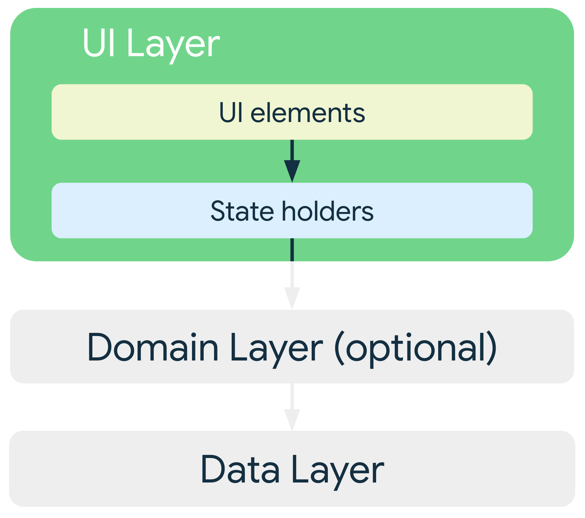
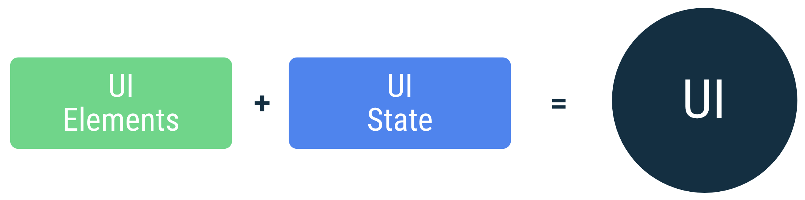
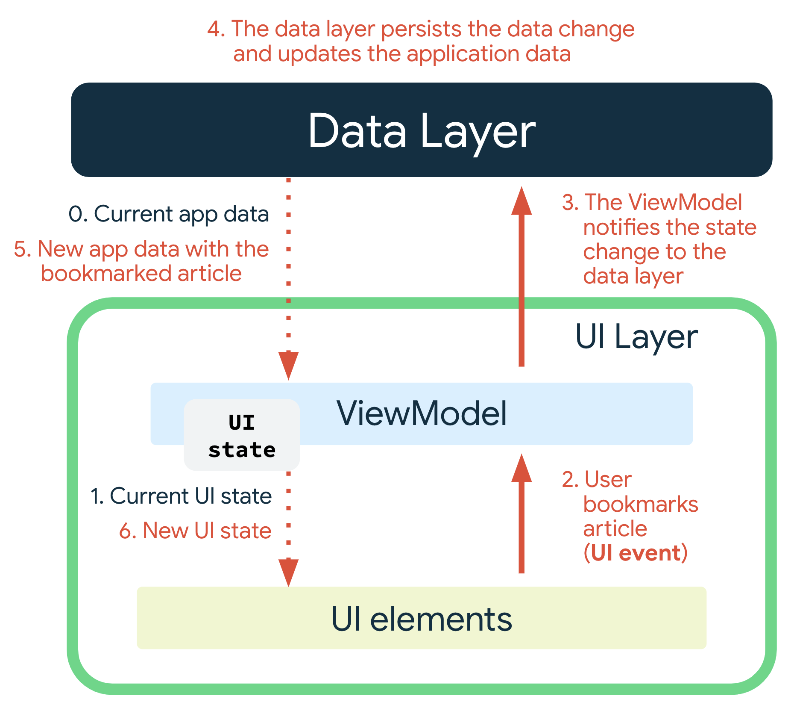
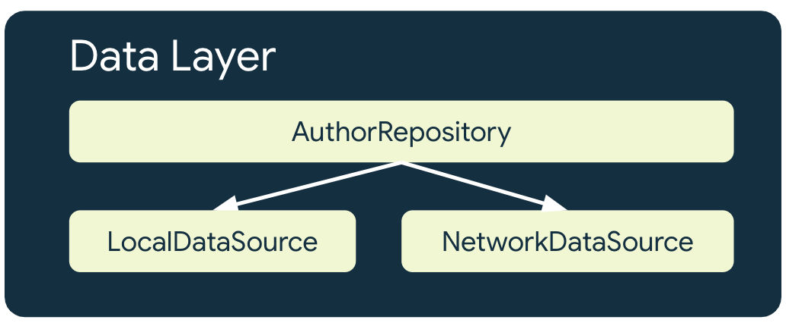

### Android推荐应用架构

界面层-->网域层-->数据层

- 关注点分离（分层，抽象）
- 通过数据模型驱动界面
- 单一数据源
- 单向数据流

### 界面层

界面是数据的直观表现，界面随着数据的变化而变化

单向数据流 (UDF)

### 网域层
网域层是位于界面层和数据层之间的可选层
网域层负责封装复杂的业务逻辑，或者由多个 ViewModel 重复使用的简单业务逻辑

### 数据层

