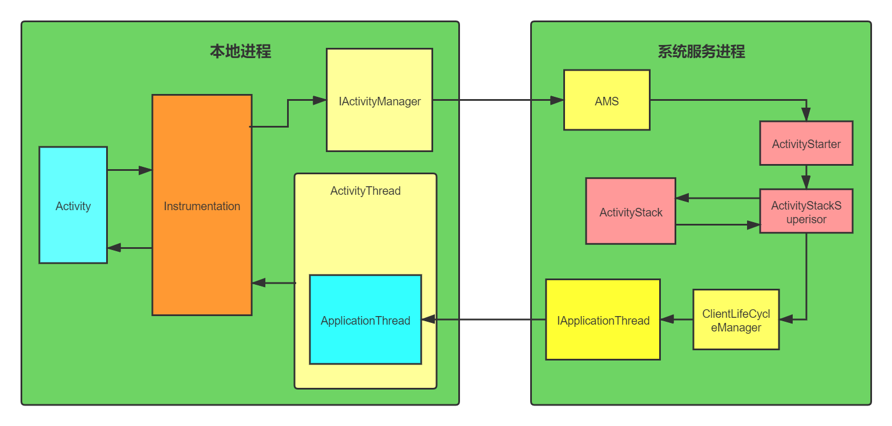
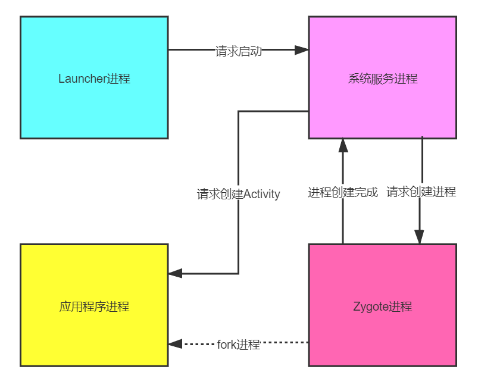

#### 1 生命周期


#### 2 启动模式

- standard
  这种是标准启动模式，默认就是这种启动模式。每次启动这种启动模式的活动的时候都会创建一个新的实例放入栈中，不管栈中是否已经存在相同的实例
<br>

- singleTop
  如果栈顶有该activity的实例 通过onNewIntent()复用
<br>

- singleTask
  这个启动模式可以指定栈去启动，如果栈中没有相同的实例，那么就会创建一个新的实例放入栈中；如果指定栈中存在相同的实例，就通过通过onNewIntent()复用
<br>
- singleInstance
  单例模式。这个是singleTask的强化版本。他会自己新建一个栈并把这个新的实例放进去，而且这个栈只能放这个活动实例。所以当重复启动这个活动的时候，只要他存在，都是调用这个活动onNewIntent方法并切换到这个栈中，并不会去创建新的实例
<br>  

singleTask指定栈
```kotlin
<activity android:name=".Main2Activity"
         android:launchMode="singleTask"
         android:taskAffinity="com.huan"
         android:allowTaskReparenting="true"/>
```
<br>

#### 3 Activity启动流程

**普通Activity的创建**


启动过程设计到两个进程：本地进程和系统服务进程。本地进程也就是我们的应用所在进程，系统服务进程为所有应用共用的服务进程

- activity向Instrumentation请求创建
<br>
- Instrumentation通过AMS在本地进程的IBinder接口，访问AMS，这里采用的跨进程技术是AIDL
<br>
- 然后AMS进程一系列的工作，如判断该activity是否存在，启动模式是什么，有没有进行注册等等
<br>
- 通过ClientLifeCycleManager，利用本地进程在系统服务进程的IBinder接口直接访问本地ActivityThread
<br>
- ApplicationThread接收到服务端的事务后，把事务直接转交给ActivityThread处理
<br>
- ActivityThread通过Instrumentation利用类加载器进行创建实例，同时利用Instrumentation回调activity的生命中周期
<br>

涉及到的类
- Instrumentation是activity与外界联系的类（不是activity本身的统称外界，相对activity而言），activity通过Instrumentation来请求创建，ActivityThread通过Instrumentation来创建activity和调用activity的生命周期。
<br>
- ActivityThread，每个应用程序唯一一个实例，负责对Activity创建的管理，而ApplicationThread只是应用程序和服务端进程通信的类而已，只负责通信，把AMS的任务交给ActivityThread。
<br>
- AMS，全称ActivityManagerService，负责统筹服务端对activity创建的流程
<br>

**根Activity的创建**


主要涉及四个进程

- Launcher进程，也就是桌面进程
- 系统服务进程，AMS所在进程
- Zygote进程，负责创建进程
- 应用程序进程，也就是即将要启动的进程

主要流程

- Launcher进程请求AMS创建activity
- AMS请求Zygote创建进程
- Zygote通过fork自己来创建进程。并通知AMS创建完成
- AMS通知应用进程创建根Activity


