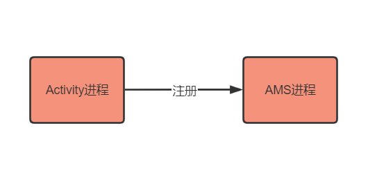
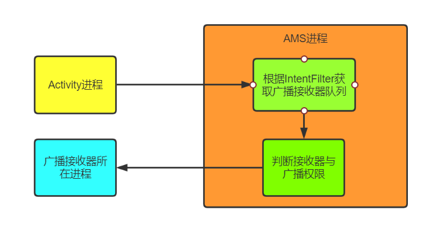

#### 1 Broadcast概念
用于进程/线程间通讯

BroadcastReceiver分为两类
- 静态广播接收者 在AndroidManifest.xml文件里声明BroadcastReceiver
- 动态广播接收者 通过registerReceiver()来注册 在不需要是要unregisterReceiver()
 

#### 2 Broadcast注册流程

- Activity进程，即注册广播所在进程。
- AMS进程，AMS即ActivityManagerService，该进程为AMS所在进程
 

#### 3 Broadcast广播流程

- Activity把广播发送到AMS中
- AMS首先检测广播是否合法，然后根据IntentFilter规则，把所有符合条件的广播接收器整理成一个队列
- 依次遍历队列中的广播接收器，判断是否拥有权限
- 把广播发送到广播接收器所在进程，回调广播的onReceive方法

