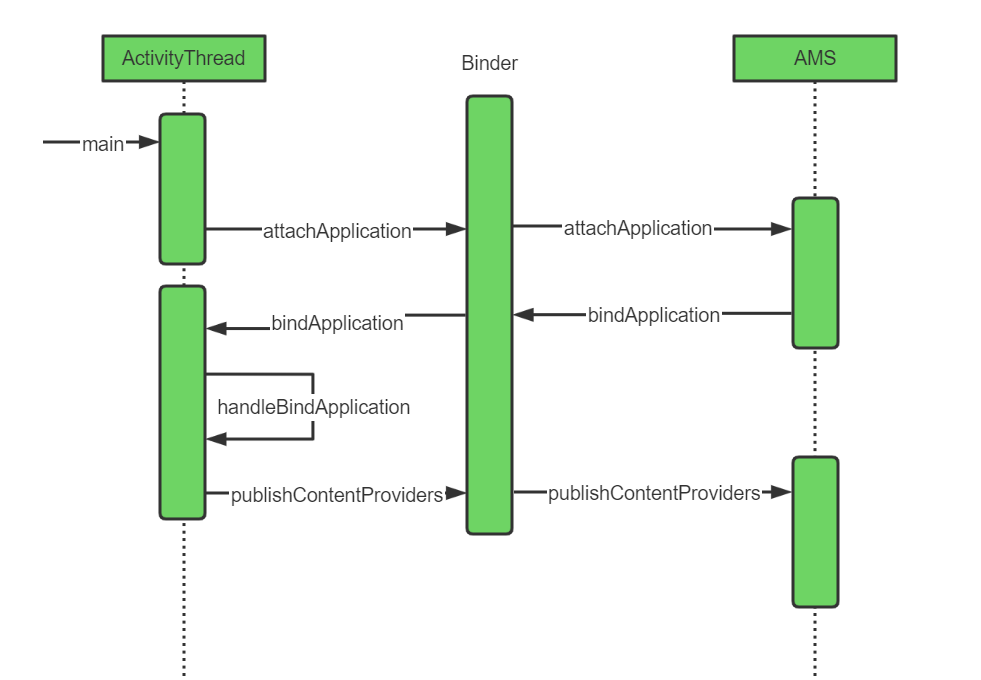
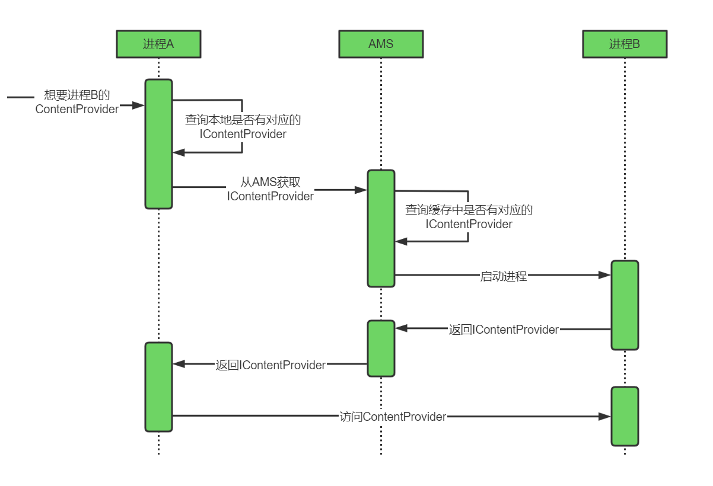

#### 1 ContentProvider概念
ContentProvider(内容提供者)用于提供数据的统一访问格式，封装底层的具体实现。对于数据的使用者来说，无需知晓数据的来源是数据库、文件，或者网络，只需简单地使用ContentProvider提供的数据操作接口，也就是增(insert)、删(delete)、改(update)、查(query)四个过程
 

#### 2 ContentProvider启动流程

- 应用进程创建后的代码入口是ActivityThread的main函数，然后他通过Binder机制把ApplicationThread发送给AMS进行缓存，以后AMS要访问该进程就是通过ApplicationThread来访问的。
- AMS做处理之后，通过ApplicationThread来让ActivityThread进行初始化。
- 在ActivityThread初始化中会创建ContextImp，Application和ContentProvider。
- 然后ActivityThread把ContentProvider发布到AMS中。以后如果有别的进程想要读取数据可以直接从AMS中获取到对应的ContentProvider。
 

#### 3 ContentProvider的请求流程

- 首先会查询本地是否有和URI对应的IContentProvider，有的话直接使用，没有的话去AMS获取。
- 如果ContentProvider对应的进程已启动，那么AMS一般是有该IContentProvider的，原因在上面的启动有讲。但是如果应用尚未启动，那么需要AMS去启动该进程。
- 进程B启动后会自然把IContentProvider发布给AMS，AMS先把他缓存起来，然后再返回给进程A
- 进程A拿到IContentProvider之后，就是直接跨进程访问ContentProvider了
