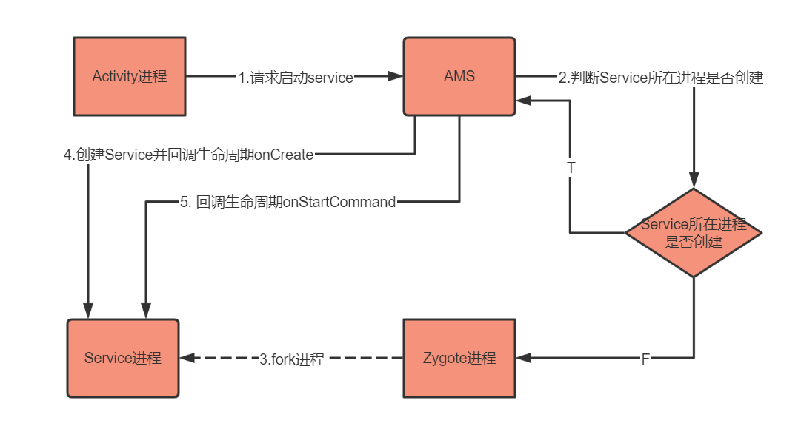
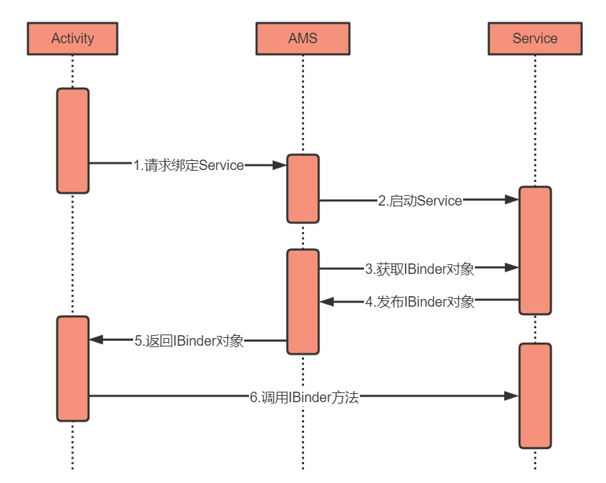

#### 1 service概念
是一种可在后台执行长时间操作而不提供应用界面的组件
默认情况下服务会运行在主线程内 若要执行耗时操作需要创建线程来执行

#### 2 service启动方式
- startService()
onCreate()--onStartCommand()--onDestroy()
调用stopSelf()或者其他组件调用stopService()服务才会终止
 

- bindService()
onCreate()--onBind()--onUnbind()--onDestroy()
绑定的组件通过unbindService()解绑服务也会销毁
如果同时startService()和bindService()组件unbindService()之后服务也不会销毁必须调用stopSelf()或者其他组件调用stopService()服务才会终止

#### 3 启动流程概述

- Activity向AMS，即ActivityManagerService请求启动Service
- AMS判断Service所在的进程是否已经创建，注意Service和Activity是可以同个进程的
- 如果还没创建则通过Zygote进程fork一个进程
- AMS请求Service所在进程的ActivityThread创建Service和启动，并回调Service的onCreate方法
- Service创建完成之后，AMS再次请求ActivityThread进行相关操作并回调onStartCommand方法
 

#### 4 绑定流程概述

- Activity请求AMS绑定Service
- AMS判断Service是否已经启动了。如果还没启动会先去启动Service
- AMS调用Service的onBind方法获取Service的IBinder对象
- Service把自己的IBinder对象发布到AMS中保存，这样下次绑定就不需要再调用onBind了
- 把拿到的IBinder对象返回给Activity
- Activity可以直接通过这个IBinder对象访问Service
