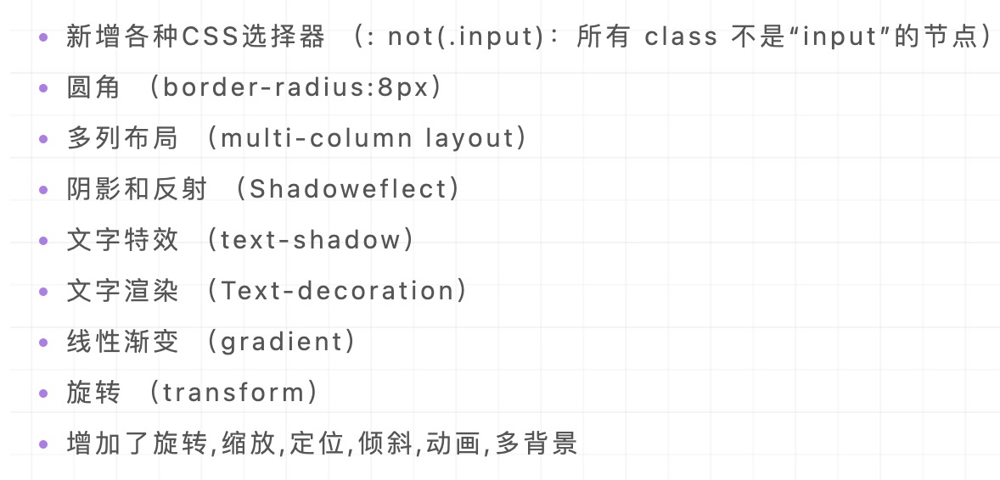
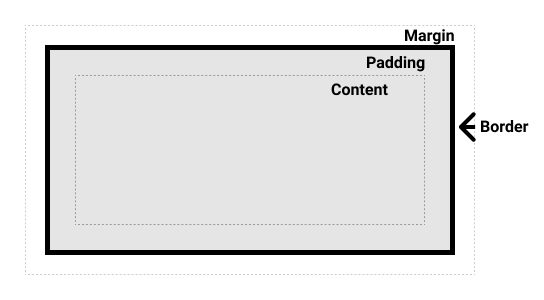
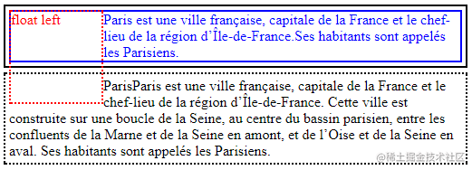
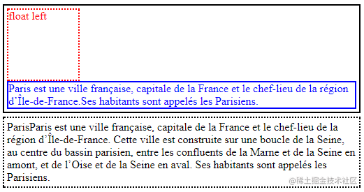
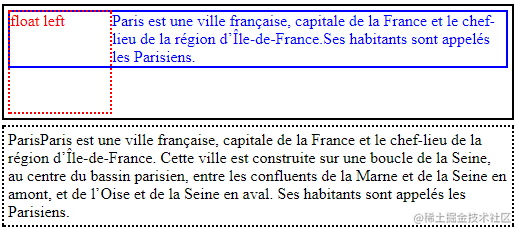
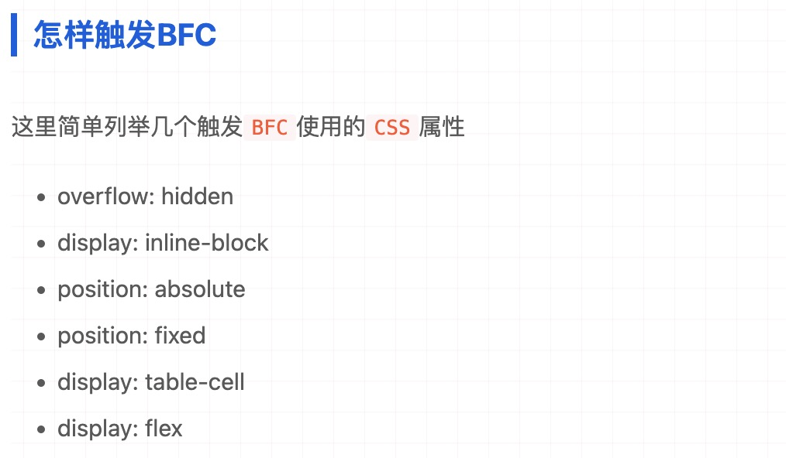

#### flex布局

- position  flex
- justify-content  主轴方向排列
- align-items  交叉轴排列
- align-self  单独子容器交叉轴排列
- flex-direction 排列方式  row column


#### 居中

- 水平居中 text-align center
- line-height : height
- flex

#### css3新特性
- 边框圆角 border-radius
- 阴影     box-shadow
- 对文字加特效 text-shadow
- 线性渐变  linear-gradient
- 径向渐变  radial-gradient




#### 盒模型
完整的 CSS 盒模型应用于块级盒子，内联盒子只使用盒模型中定义的部分内容。模型定义了盒的每个部分 —— margin, border, padding, and content —— 合在一起就可以创建我们在页面上看到的内容



**offsetWidth**
offsetWidth = width+border+padding,不包括margin

#### 块级元素和行内元素
HTML（超文本标记语言）中元素大多数都是“块级”元素或行内元素

- 块级元素占据其父元素（容器）的整个水平空间，垂直空间等于其内容高度，因此创建了一个“块”，display:block可以把元素转换为块级元素
- 个行内元素只占据它对应标签的边框所包含的空间，display:inline把元素转换为行内元素


#### 清除浮动

```html
<div class="topDiv">
    <div class="floatDiv">float left</div>
    <div class="textDiv">...</div>
</div>
<div class="bottomDiv">...</div>
```

```css
.topDiv {
    width: 500px;
    border: 2px solid black;
}
.floatDiv {
    width: 100px;
    height: 100px;
    border: 2px dotted red;
    color: red;
    margin: 4px;
    float: left;
}
.bottomDiv {
    width: 500px;
    height: 100px;
    margin: 5px 0;
    border: 2px dotted black;
}
.textDiv {
    color: blue;
    border: 2px solid blue;
}
```



**clear样式**

```css
.textDiv {
    color: blue;
    border: 2px solid blue;

    clear: left;
}
```



**BFC**
块格式化上下文（Block Formatting Context，BFC）是 Web 页面的可视 CSS 渲染的一部分，是块级盒子的布局过程发生的区域，也是浮动元素与其他元素交互的区域。

简单来说就是，BFC是一个完全独立的空间（布局环境），让空间里的子元素不会影响到外面的布局

```css
.topDiv {
    width: 500px;
    padding: 4px;
    border: 2px solid black;

    // 区别在这里
    overflow: auto;
}
```
```css
.topDiv {
    width: 500px;
    padding: 4px;
    border: 2px solid black;

    // 区别在这里
    display: inline-block;
}s
```





<br>


#### 设置滚动条样式

```css
:global {
  ::-webkit-scrollbar {
    display: block;
    width: 6px;
    height: 6px;
  }
  ::-webkit-scrollbar-thumb {
    background: #ccc;
    border-radius: 50px;
    -webkit-box-shadow: inset 0 0 5px rgba(0, 0, 0, 0.2);
  }
  ::-webkit-scrollbar-track {
    background: #f3f3f3;
    border-radius: 30px;
    -webkit-box-shadow: inset 0 0 5px rgba(0, 0, 0, 0.2);
  }
}
```


<br>

**参考**

[清除浮动的四种方式及其原理理解](https://juejin.cn/post/6844903504545316877)
[块格式化上下文](https://developer.mozilla.org/zh-CN/docs/Web/Guide/CSS/Block_formatting_context)
[面试官：请说说什么是BFC？大白话讲清楚](https://juejin.cn/post/6950082193632788493)