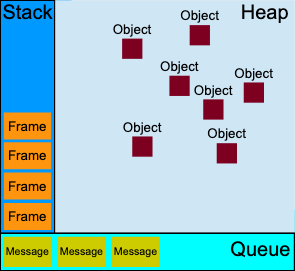
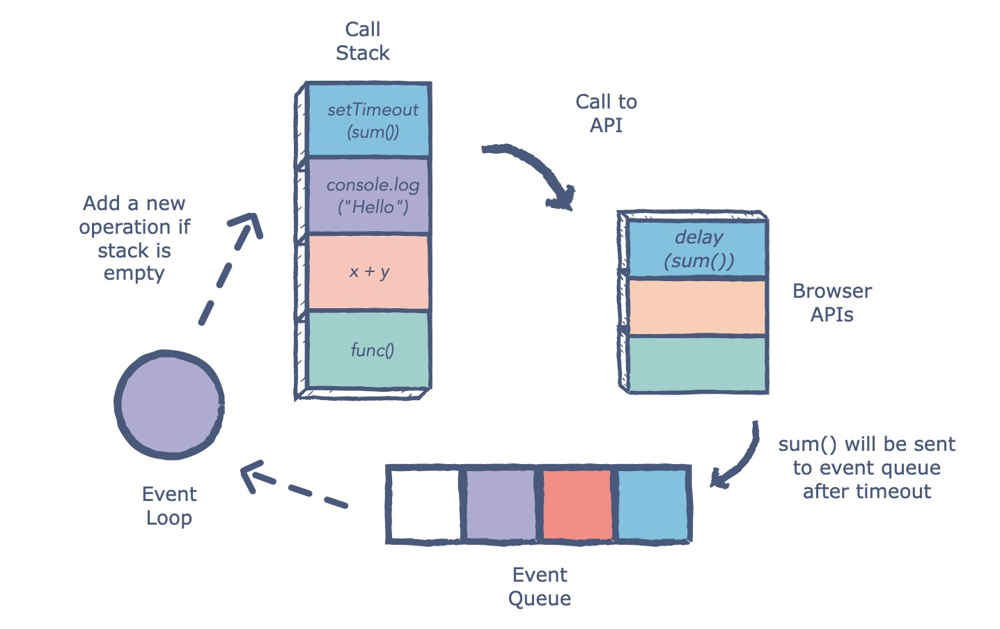
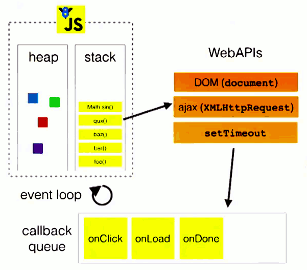
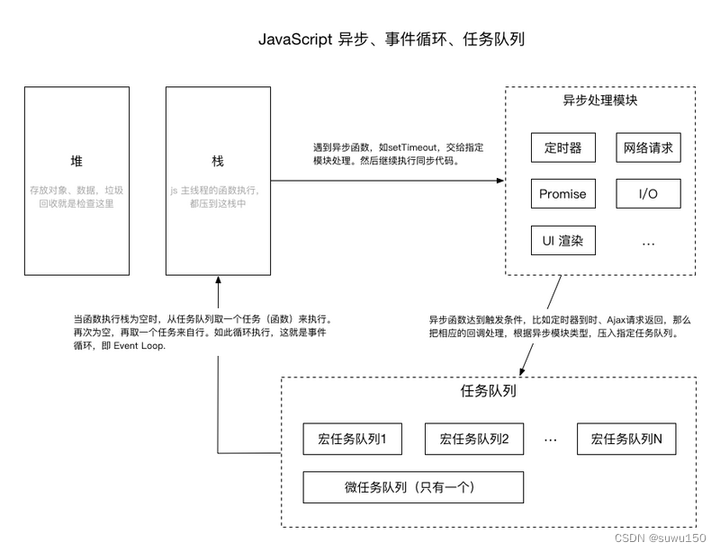

#### 深拷贝和浅拷贝

深拷贝复制了对象 浅拷贝复制了引用

- 深拷贝
  JSON.stringify
  JSON.parse
  lodash  _.cloneDeep
<br>  

- 浅拷贝
  Object.assign()
  扩展运算符 ...
<br>

####  数组去重

- set
  
  ```javaScript
  Array.from(new Set(arr))
  ```
  
<br>  

- reduce
  ```javaScript
  const arr1 = arr.reduce((previousValue, currentValue) => {
    if (previousValue.indexOf(currentValue) === -1) {
      previousValue.push(currentValue);
    }
    return previousValue;
  }, []);
  ```
 <br> 

####  event loop

它是一个在 JavaScript 引擎等待任务，执行任务和进入休眠状态等待更多任务这几个状态之间转换的无限循环

- 所有同步任务都在主线程上执行，形成一个执行栈（execution context stack）
- 主线程之外，还存在一个"任务队列"（task queue）。只要异步任务有了运行结果，就在"任务队列"之中放置一个事件
- 一旦"执行栈"中的所有同步任务执行完毕，系统就会读取"任务队列"，看看里面有哪些事件。那些对应的异步任务，于是结束等待状态，进入执行栈，开始执行
- 主线程不断重复上面的第三步

**运行时概念**



**event loop**





#### 任务 vs 微任务

**任务（tasks）**
一个任务就是由执行诸如从头执行一段程序、执行一个事件回调或一个 interval/timeout 被触发之类的标准机制而被调度的任意 JavaScript 代码。这些都在任务队列（task queue）上被调度
<br>

#### Promise
Promise 是一种对异步操作的封装，里面包含未来才会结束的某个事件（异步操作）的结果 可以将异步操作以同步操作的流程表达出来，还是使用的回调方式(then的形参其实就是callback)

**promise的三种状态**

- pending-进行中
- fulfilled-已成功
- rejected-已失败

> 一旦状态改变就不会再变

**promise 用法**
```js
const promise = new Promise((resolve,reject)=>{
  resolve(1)
  reject("reject")
})
const result = promise.then((result)=>{
  result = result+1
  console.log(result)
}).catch((error)=>{
  console.log("Promise catch invoke error = "+error)
}).finally(()=>{
  console.log("Promise finally invoke")
})
```