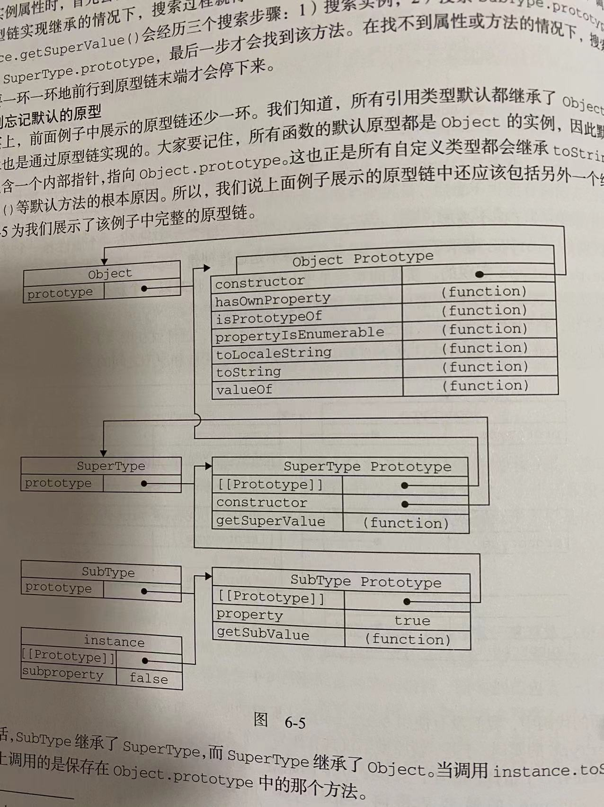

#### 深拷贝和浅拷贝

深拷贝复制了对象 浅拷贝复制了引用

- 深拷贝
  JSON.stringify
  JSON.parse
  lodash  _.cloneDeep
<br>  

- 浅拷贝
  Object.assign()
  扩展运算符 ...
<br>

####  数组去重

- set
  
  ```javaScript
  Array.from(new Set(arr))
  ```
  
<br>  

- reduce
  ```javaScript
  const arr1 = arr.reduce((previousValue, currentValue) => {
    if (previousValue.indexOf(currentValue) === -1) {
      previousValue.push(currentValue);
    }
    return previousValue;
  }, []);
  ```
 <br> 

####  event loop

它是一个在 JavaScript 引擎等待任务，执行任务和进入休眠状态等待更多任务这几个状态之间转换的无限循环

- 所有同步任务都在主线程上执行，形成一个执行栈（execution context stack）
- 主线程之外，还存在一个"任务队列"（task queue）。只要异步任务有了运行结果，就在"任务队列"之中放置一个事件
- 一旦"执行栈"中的所有同步任务执行完毕，系统就会读取"任务队列"，看看里面有哪些事件。那些对应的异步任务，于是结束等待状态，进入执行栈，开始执行
- 主线程不断重复上面的第三步

**运行时概念**


**event loop**


#### 任务 vs 微任务

**任务（tasks）**
一个任务就是由执行诸如从头执行一段程序、执行一个事件回调或一个 interval/timeout 被触发之类的标准机制而被调度的任意 JavaScript 代码。这些都在任务队列（task queue）上被调度
<br>

#### Promise
Promise 是一种对异步操作的封装，里面包含未来才会结束的某个事件（异步操作）的结果 可以将异步操作以同步操作的流程表达出来，还是使用的回调方式(then的形参其实就是callback)

**promise的三种状态**

- pending-进行中
- fulfilled-已成功
- rejected-已失败

> 一旦状态改变就不会再变

**promise 用法**
```js
const promise = new Promise((resolve,reject)=>{
  resolve(1)
  reject("reject")
})
const result = promise.then((result)=>{
  result = result+1
  console.log(result)
}).catch((error)=>{
  console.log("Promise catch invoke error = "+error)
}).finally(()=>{
  console.log("Promise finally invoke")
})
```
<br>

#### 闭包

闭包就是能够读取其他函数内部变量的函数

是指有权访问另一个函数作用域中的变量的函数

```js
function f1(){
　　var n=999;
　　function f2(){
　　　　alert(n);
　　}
　　return f2;
}
var result=f1();
result(); // 999
```

- 读取函数内部的变量
- 让这些变量的值始终保持在内存中
- 闭包会引起内存泄露
<br>

#### 原型和原型链
- 原型对象是用来存放特定类型的所有实例共享的属性和方法
- 每个函数都会有prototype属性（指针）指向原型对象
- 默认情况下原型对象会有一个constructor属性 指向该类型的构造函数
- 我们可以给原型对象添加其他的属性和方法
- 实例对象通过_proto_指向构造函数的原型对象  而不是指向构造函数
- 替换子类的原型，将子类的原型指向父类的实例




<br>

#### var const let 区别

- 变量提升 var存在变量提升 const和let不存在变量提升
  ```js
  // var 的情况
  console.log(foo); // 输出undefined
  var foo = 2;

  // let 的情况
  console.log(bar); // 报错ReferenceError
  let bar = 2;
  ```  

- 暂时性死区 const和let存在暂时性死区 (temporal dead zone)
  ```js
  var tmp = 123;

  if (true) {
    tmp = 'abc'; // ReferenceError
    let tmp;
  }
  ```  
- 重复声明  const和let不允许重复性声明，var可以重复声明
  ```js
  // 报错
  function func() {
    let a = 10;
    var a = 1;
  }

  // 报错
  function func() {
    let a = 10;
    let a = 1;
  }  
  ```

- let为javaScript新增了块级作用域   ES5只有全局作用域和函数作用域

  ```js
  {
    let a = 10;
    var b = 1;
  }

  a // ReferenceError: a is not defined.
  b // 1
  ```

  ```js
  var a = [];
  for (var i = 0; i < 10; i++) {
    a[i] = function () {
      console.log(i);
    };
  }
  a[6](); // 10
  ```
  ```js
  var a = [];
  for (let i = 0; i < 10; i++) {
    a[i] = function () {
      console.log(i);
    };
  }
  a[6](); // 6
  ```
<br>

#### 箭头函数

- 箭头函数的this对象是固定的
  对于普通函数来说，内部的this指向函数运行时所在的对象，但是这一点对箭头函数不成立。它没有自己的this对象，内部的this就是定义时上层作用域中的this。也就是说，箭头函数内部的this指向是固定的，相比之下，普通函数的this指向是可变的

  下面是ES6转成ES5的代码，箭头函数的this绑定在定义上层的作用域上
  ```js
  // ES6
  function foo() {
    setTimeout(() => {
      console.log('id:', this.id);
    }, 100);
  }

  // ES5
  function foo() {
    var _this = this;

    setTimeout(function () {
      console.log('id:', _this.id);
    }, 100);
  }
  ```  

- 不可以当作构造函数，也就是说，不可以对箭头函数使用new命令，否则会抛出一个错误，也是因为this指向的问题

- 不可以使用yield命令，因此箭头函数不能用作 Generator 函数
<br>

#### 作用域
变量（基本数据类型和引用数据类型）的执行环境，可以分为全局作用域和函数作用域

作用域是在运行时代码中的某些特定部分中变量，函数和对象的可访问性。换句话说，作用域决定了代码区块中变量和其他资源的可见性

