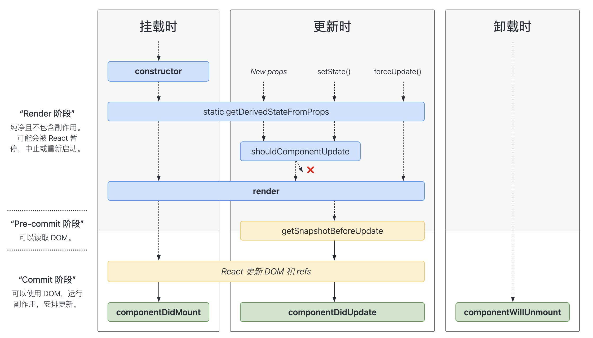

#### 1 react 生命周期

- constructor  componentWillMount  render  componentDidMount  componentWillUnMount
- componentWillUpdate render componentDidUpdate
- shouldComponentUpdate  ( return boolean )

#### 2 虚拟DOM
virtual DOM是用javaScript对象对DOM的抽象（ 原生dom在内存中的js对象映射 ）

**为什么使用virtual DOM**
- 无需手动操作DOM
- 可以批量更新 频繁状态变更减少页面的渲染次数
- 跨平台渲染
- diff算法

**diff算法**
- diff算法的时间复杂度为O(n)
- 两个不同类型的元素会产生不同的树 不同类型元素会删除
- 可以通过key prop来暗示哪些子元素在不同的渲染下能保持稳定

#### 3 setState过程
- setState()将对state的更改排入队列，并通知React需要使用更新后的state组件和子组件
- setState()并不总是立即更新组件，它会批量推迟更新
- 将setState()视为请求而不是立即更新组件的命令
- 非合成事件和生命周期函数（ 原生点击事件 setTimeout fetch等 ）是同步执行的
- 合成事件和生命周期函数不是同步执行的

#### 4 hook
**使用hook目的**
- 加强函数组件 在不使用class的情况下使用state和以及其他react特性
- 在组件间复用逻辑很难 没有hook之前 复用逻辑使用高阶组件和render props
- 复杂组件难以理解 生命周期里耦合不同的逻辑 容易产生bug

**常用hook**
- useState
  接收一个初始值参数 返回一个数组 0 state 1 setState
 

- useContext
  共享状态钩子
  

- useReducer
  action钩子 参数 reducer initState 返回值 [state dispatch]
 

- useEffect
  副作用钩子  参数  1 fun 副作用函数 2 [] 依赖数组 useEffect可以返回一个函数用于在卸载时清除函数

**hook规则**
- 只在最顶层使用hook
- 只在React函数中调用hook(函数组件和自定义hook)
