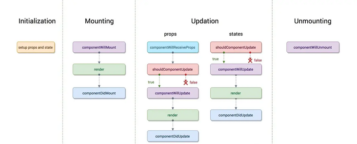

#### 1 react 生命周期

- constructor  componentWillMount  render  componentDidMount  componentWillUnMount
- componentWillUpdate render componentDidUpdate
- shouldComponentUpdate  ( return boolean )

**16.3**

**>=16.4**

 

**废弃的生命周期**
- componentWillMount
- componentWillReceiveProps
- componentWillUpdate

**废弃原因**
React Fiber 架构中，一个组件的渲染分为两个阶段： render阶段 和 commit阶段
- Render阶段 纯净且不包含副作用。可能会被 React 暂停，中止或重新启动。 render阶段是可以被打断的，一旦被打断，这阶段所做的事情都被废弃，让React处理完紧急的任务回来，会重新渲染着个组件。 也是就是会执行render()之前的生命周期函数。componentWillMount，componentWillReceiveProps，componentWillUpdate 会被多次调用

- Commit阶段不可被打断，可以使用 DOM，运行副作用，安排更新

 

#### 2 虚拟DOM
virtual DOM是用javaScript对象对DOM的抽象（ 原生dom在内存中的js对象映射 ）

**为什么使用virtual DOM**
- 无需手动操作DOM
- 可以批量更新 频繁状态变更减少页面的渲染次数
- 跨平台渲染
- diff算法

**diff算法**
- diff算法的时间复杂度为O(n)
- 两个不同类型的元素会产生不同的树 不同类型元素会删除
- 可以通过key prop来暗示哪些子元素在不同的渲染下能保持稳定

 

#### 3 setState过程
- setState()将对state的更改排入队列，并通知React需要使用更新后的state组件和子组件
- setState()并不总是立即更新组件，它会批量推迟更新
- 将setState()视为请求而不是立即更新组件的命令
- 非合成事件和生命周期函数（ 原生点击事件 setTimeout fetch等 ）是同步执行的
- 合成事件和生命周期函数不是同步执行的

> 如想等state设置好后使用，可以在setState回调中处理

 

#### 4 hook

**函数**

函数一般来说，只应该做一件事，就是返回一个值。 如果你有多个操作，每个操作应该写成一个单独的函数。而且，数据的状态应该与操作方法分离。根据这种理念，React 的函数组件只应该做一件事情：返回组件的 HTML 代码，而没有其他的功能

 

**使用hook目的**
- 加强函数组件 在不使用class的情况下使用state和以及其他react特性
- 在组件间复用逻辑很难 没有hook之前 复用逻辑使用高阶组件和render props
- 复杂组件难以理解 生命周期里耦合不同的逻辑 容易产生bug

>钩子（hook）就是 React 函数组件的副效应解决方案，用来为函数组件引入副效应。 函数组件的主体只应该用来返回组件的 HTML 代码，所有的其他操作（副效应）都必须通过钩子引入
 

**常用hook**
- useState
  接收一个初始值参数 返回一个数组 0 state 1 setState
 

- useContext
  共享状态钩子，共享react全局context
  

- useReducer
  action钩子 参数 reducer initState 返回值 [state dispatch]
 

- useEffect
  副作用钩子  参数  1 fun 副作用函数 2 [] 依赖数组 useEffect可以返回一个函数用于在卸载时清除函数

**hook规则**
- 只在最顶层使用hook
- 只在React函数中调用hook(函数组件和自定义hook)

 

#### Fiber

**时间切片**
基本思路是把 JS 运算 切割成多个任务，分批完成各个任务。在完成一部分任务后，把执行的控制权交还给浏览器，让其有时间进行渲染工作。渲染完成后，再进行未完成的计算任务

这种将长任务分拆到每一帧中，像蚂蚁搬家一样一次执行一小段任务的操作，被称为时间切片 (time slice)

 

**参考**

[React 之技术详解 (一) - Fiber 理念篇](https://www.lumin.tech/blog/react-1-concept/)
