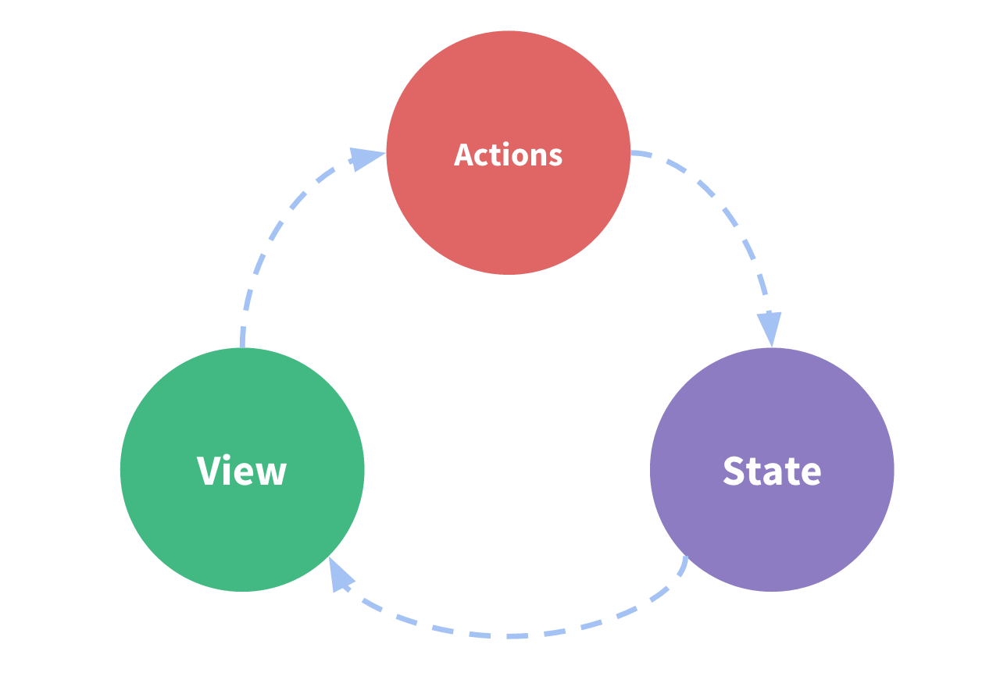

**redux概念**
redux A Predictable State Container for JS Apps
js项目里一个可预测的状态容器

- store 全局数据中心
- action  描述state发生了什么变化
- reducer 修改state(纯函数)

**特点**

- Predictable 可预测
- Centralized 集中化
- Debuggable  可测试
- Flexible    灵活的

**三大原则**
- 单一数据源
  整个应用的state被存在一棵object tree中 而这个object tree被存在唯一的store中
 

- state是只读的
  唯一改变state的方式就是触发action，action是一个描述已发生事件的普通对象
 

- 使用纯函数来执行修改

**单向数据流**
  

**数据流**

**异步数据流**

**Middleware**

中间件就是一个函数，对store.dispatch方法进行了改造，在发出 Action 和执行 Reducer 这两步之间，添加了其他功能，处理异步等功能

**React-Redux**
Redux 的作者封装了一个 React 专用的库 React-Redux
React-Redux 将所有组件分成两大类：UI 组件（presentational component）和容器组件（container component）

UI组件
- 只负责 UI 的呈现，不带有任何业务逻辑
- 没有状态（即不使用this.state这个变量）
- 所有数据都由参数（this.props）提供
- 不使用任何 Redux 的 API

容器组件
- 负责管理数据和业务逻辑，不负责 UI 的呈现
- 带有内部状态
- 使用 Redux 的 API

