# Vue框架设计

## 前言

最近读了一本书，书名叫《Vue.js设计与实现》（作者：霍春阳），通过这本书学习了很多，想以这本书为基础来学习Vue框架的原理。
该书内容并非“源码解读”，而是建立在作者对 Vue.js 框架设计的理解之上，以由简入繁的方式介绍如何实现 Vue.js 中的各个功能模块。

## Vue3的设计思路

Vue是一个UI框架，一个UI框架设计需要从描述，渲染，更新UI来考虑。

### 声明式UI

和声明式UI对应的命令式UI，命令式UI和声明式UI是对描述UI方式的一种划分，命令式UI在前端中就是直接操作DOM，关注过程，比如jQuery，声明式UI是描述想要UI的结果，框架会根据状态的变化自动更新UI，更容易维护。

目前理解，声明式UI其实在加了一些语法糖，来简化UI操作，声明式UI是一种趋势，目前流行的前端框架React，Vue，都是使用的声明式UI

#### Vue中声明式UI方案

- 使用与HTML标签一致的方式来描述DOM元素，如`<div></div>`
- 使用与HTML标签一致的方式来描述属性，如`<div id="app"></div>`
- 使用指令`v-bing`或者`:`来绑定动态属性，如`<div :id="dynamicedId"></div>`
- 使用指令`@`或者`v-on`来描述事件，如`<div @click='handleClick'></div>`

#### DSL（Domain-specific language）领域特定语言

DSL是针对特定应用领域的计算机语言。

Vue中的模版是一种DSL，它使用HTML结构，并通过Vue的指令（directives）和表达式（expressions）来实现数据绑定、条件渲染、事件监听等功能

### 虚拟DOM

虚拟DOM是通过javaScript对象来描述DOM结构，通过渲染器把虚拟DOM渲染成DOM，页面更新时通过对比虚拟DOM的变更来更新DOM。

虚拟DOM优势

- 页面更新时，直接操作DOM开销大，虚拟DOM可以快速的找出变化的UI，批量更新，避免频繁更新UI
- 跨平台，除了可以渲染成DOM，也可以渲染成别的平台UI

虚拟DOM难点

- 虚拟DOM的难点在于找出页面更新时变化的节点使用的diff算法

```javascript
const vnode = {
  tag: 'div',
  props: {
    onClick: () => alert('hello')
  },
  children: 'click me'
}
```

### 编译器

编译器（compiler）是一种计算机程序，它会将某种编程语言写成的源代码（原始语言）转换成另一种编程语言（目标语言）

#### Vue中的编译器

Vue模版编译器，源代码是组件的模版，目标代码是JavaScript运行时平台上的JavaScript代码，其实就是编译成渲染函数

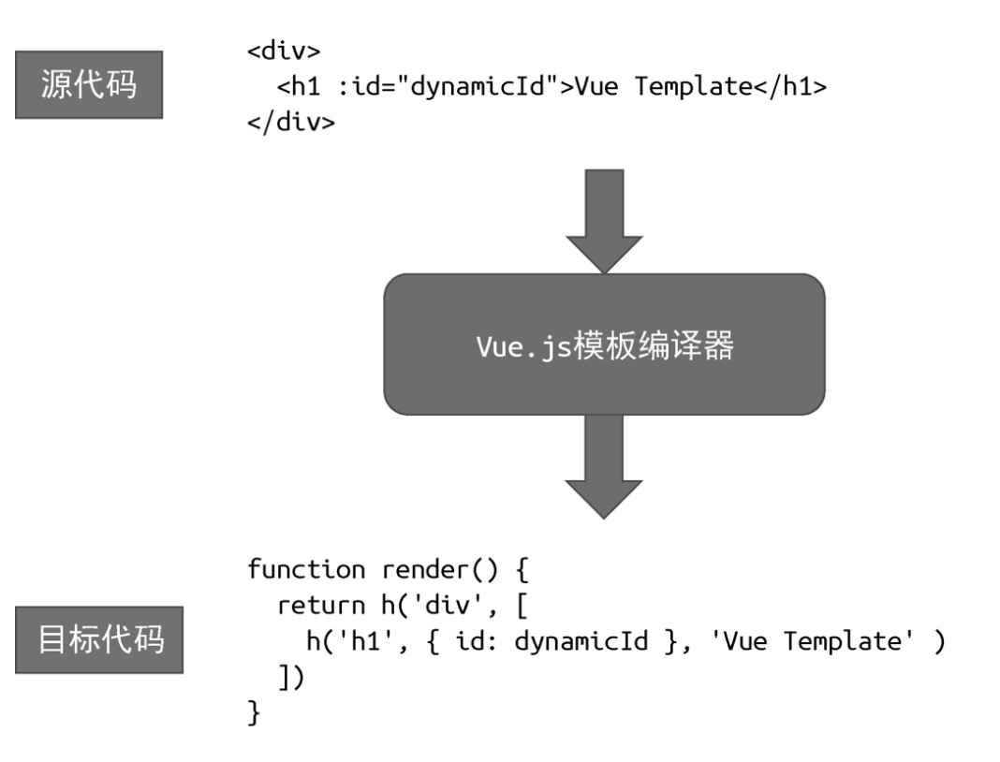

Vue模板编译器会首先对模板进行词法分析和语法分析，得到模版AST。接着将模版AST转换成JavaScript AST。最后根据JavaScript AST生成JavaScript代码

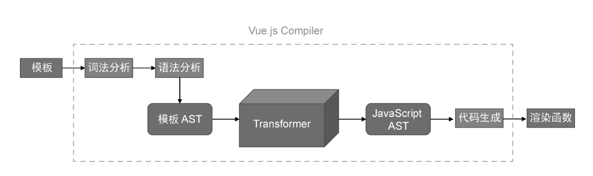

### 响应式编程（Reactive Programming）

响应式编程是一种编程范式，它强调数据流和变化的传播。当数据源发生变化时，系统会自动更新依赖于该数据的部分。这种自动化的更新机制，使得开发者可以更专注于数据的处理，而不用手动管理UI更新。

#### Vue的响应式系统

Vue通过数据劫持 + 观察者模式（发布订阅）来实现的响应式

### 组件

Vue 中，组件（Component）就像是一个自定义的 HTML 元素，它封装了可重用的 HTML、CSS 和 JavaScript 代码。
你可以把组件看作是一个独立的小型 Vue 实例，它拥有自己的数据、模板和生命周期。

渲染器主要负责将虚拟 DOM 渲染为真实 DOM，我们只需要使用虚拟 DOM
来描述最终呈现的内容即可。但当我们编写比较复杂的页面时，用来
描述页面结构的虚拟 DOM 的代码量会变得越来越多，或者说页面模板
会变得越来越大。这时，我们就需要组件化的能力。有了组件，我们
就可以将一个大的页面拆分为多个部分，每一个部分都可以作为单独
的组件，这些组件共同组成完整的页面。组件化的实现同样需要渲染
器的支持。

组件的作用

- 代码复用性
- 可维护性
- 可组合性
- 可测试性

组件也是通过虚拟DOM来描述的

```javascript
const MyComponent = function () {
  return{
    tag: 'div',
    props: {
      onClick: () => alert('hello')
    },
    children: 'click me'
  }
}
```

### 渲染器

渲染器用来执行渲染任务，把虚拟DOM渲染为真实的DOM元素，也是跨平台的关键

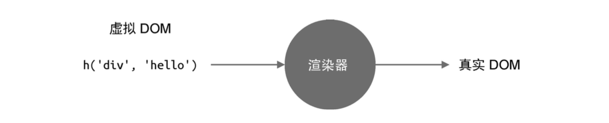

一段简单渲染器的代码来初步理解渲染器的工作

```javascript
function renderer(vnode, container) {
  // 使用 vnode.tag 作为标签名称创建 DOM 元素
  const el = document.createElement(vnode.tag)
  
  // 遍历 vnode.props，将属性、事件添加到 DOM 元素
  for(const key in vnode.props){
    if (/^on/.test(key)) {
      el.addEventListener(key.substr(2).toLowerCase(),vnode.props[key] )
    }
  }

  // 处理 children
  if (typeof vnode.children === 'string') {
    // 如果 children 是字符串，说明它是元素的文本子节点
    el.appendChild(document.createTextNode(vnode.children))
  }else if (Array.isArray(vnode.children)) {
    // 递归地调用 renderer 函数渲染子节点，使用当前元素 el 作为挂载点
    vnode.children.forEach(child => renderer(child, el))
  }

  // 将元素添加到挂载点下
  container.appendChild(el)
}
```

```javascript
export default {
  data() {/* ... */},
  methods: {
    handler: () => {/* ... */}
  },
  render(){
    return h('div', { onClick: handler }, 'click me')
  }
}
```

### 总结

Vue.js 是一个声明式的框架。声明式的好处在于，它直接描述结果，用户不需要关注过程。Vue.js采用模板的方式来描述UI，但它同样支持使用虚拟DOM来描述UI。虚拟DOM要比模板更加灵活，但模板要比虚拟DOM更加直观。

然后我们讲解了最基本的渲染器的实现。渲染器的作用是把虚拟DOM对象渲染为真实DOM元素。它的工作原理是递归地遍历虚拟DOM对象，并调用原生DOM API来完成真实DOM的创建。
渲染器的精髓在于后续的更新，它会通过Diff算法找出变更点，并且只会
更新需要更新的内容。后面我们会专门讲解渲染器的相关知识。

接着，我们讨论了组件的本质。组件其实就是一组虚拟DOM元素的封装，它可以是一个返回虚拟DOM的函数，也可以是一个对象，但这个对象下必须要有一个函数用来产出组件要渲染的虚拟DOM。渲染器在渲染组件时，会先获取组件要渲染的内容，即执行组件的渲染函数并得到其返回值，我们称之为subtree，最后再递归地调用渲染器，将subtree渲染出来即可。

Vue.js的模板会被一个叫作编译器的程序编译为渲染函数，后面我们会着重讲解编译器相关知识。
最后，编译器、渲染器都是Vue.js的核心组成部分，它们共同构成一个有机的整体，不同模块之间互相配合，进一步提升框架性能。

## 响应式系统

Vue通过数据劫持 + 观察者模式（发布订阅）来实现的响应式。

- 当读取操作发生时，将副作用函数收集到“桶”中。
- 当设置操作发生时，从“桶”中取出副作用函数并执行。

> 其中“桶”就是观察者的集合

```javascript
// 用一个全局变量存储被注册的副作用函数
let activeEffect

// 存储副作用函数的桶
const bucket = new WeakMap()

function effect(fn){
  // 当调用effect注册副作用函数时，将副作用函数fn赋值给activeEffect
  activeEffect = fn
  // 执行副作用函数
  fn()
}

const obj = new Proxy(data, {
  // 拦截读取操作
  get(target, key) {
    // 将副作用函数 activeEffect 添加到存储副作用函数的桶中
    track(target, key)
    return target[key]
  }

  // 拦截设置操作
  set(target, key, newValue){
    target[key] = newValue
    // 把副作用函数从桶里取出并执行
    trigger(target, key)
  }
});

// 在get拦截函数内调用track函数追踪变化
function track(target, key){
  if(!activeEffect){
    return
  }
  
  let depsMap = bucket.get(target)
  if(!depsMap){
    depsMap = new Map()
    bucket.set(target, depsMap)
  }

  let deps = depsMap.get(key)
  if(!deps){
    deps = new set()
    depsMap.set(key, deps)
  }

  deps.add(activeEffect)
}

// 在set拦截函数内调用trigger函数触发变化
function trigger(target, key){
  const depsMap = bucket.get(target)
  if(!depsMap){
    return
  }

  const effects = depsMap.get(key)
  effects?.forEach(fn => fn())
}
```

观察者集合的数据结构
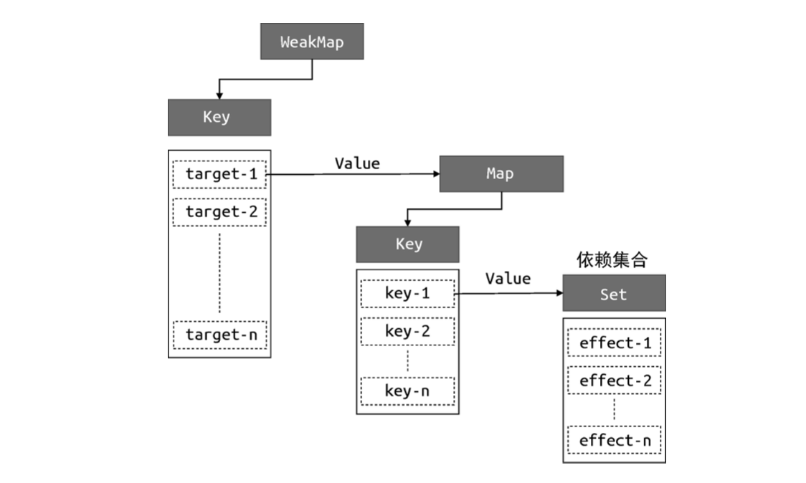

上面是一个简单的响应式系统的实现，还有很多种情况还要考虑，分支切换导致的冗余副作用的问题，嵌套的副作用函数的问题，响应系统的可调度性，
计算属性（computed），watch的实现。

计算属性，计算属性实际上是 一个懒执行的副作用函数。

watch，它本质上利用了副作用函 数重新执行时的可调度性。一个 watch 本身会创建一个 effect，当 这个 effect 依赖的响应式数据发生变化时，会执行该 effect 的调 度器函数，即 scheduler。

实现响应式数据要比想象中难很多，并不是单纯地拦截 get/set 操作即可。举例来说，如何拦截
for...in 循环?track 函数如何追踪拦截到的 for...in 循环? 类似的问题还有很多。除此之外，我们还应该考虑如何对数组进行代
理，Map、Set的代理。想要实现完善的响应式数据，需要深入语言规范，从语言规范中找到方法来实现各种数据拦截。

## 编译器

模版编译成渲染函数的流程

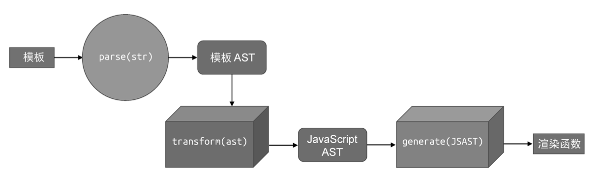

- 对模版进行词法分析和语法分析生成模版AST。

- 模版AST转换成JavaScript AST。

- 根据JavaScript AST生成JavaScript代码。

```javascript
const templateAST = parse(template)
const jsAST = transform(templateAST)
const code = generate(jsAST)
```

### 模版解析生成模版AST

解析器的入参是字符串模板，解析器会逐个读取字符串模板中的 字符，并根据一定的规则将整个字符串切割为一个个 Token。这里的 Token 可以视作词法记号。解析器是如何对模板进行切割的呢? 依据什么规则? 这就需要用到有限状态自动机。

#### 词法分析（生成Token）

> 有限状态机（英语：finite-state machine，缩写：FSM）又称有限状态自动机（英语：finite-state automaton，缩写：FSA），简称状态机，是表示有限个状态以及在这些状态之间的转移和动作等行为的数学计算模型。

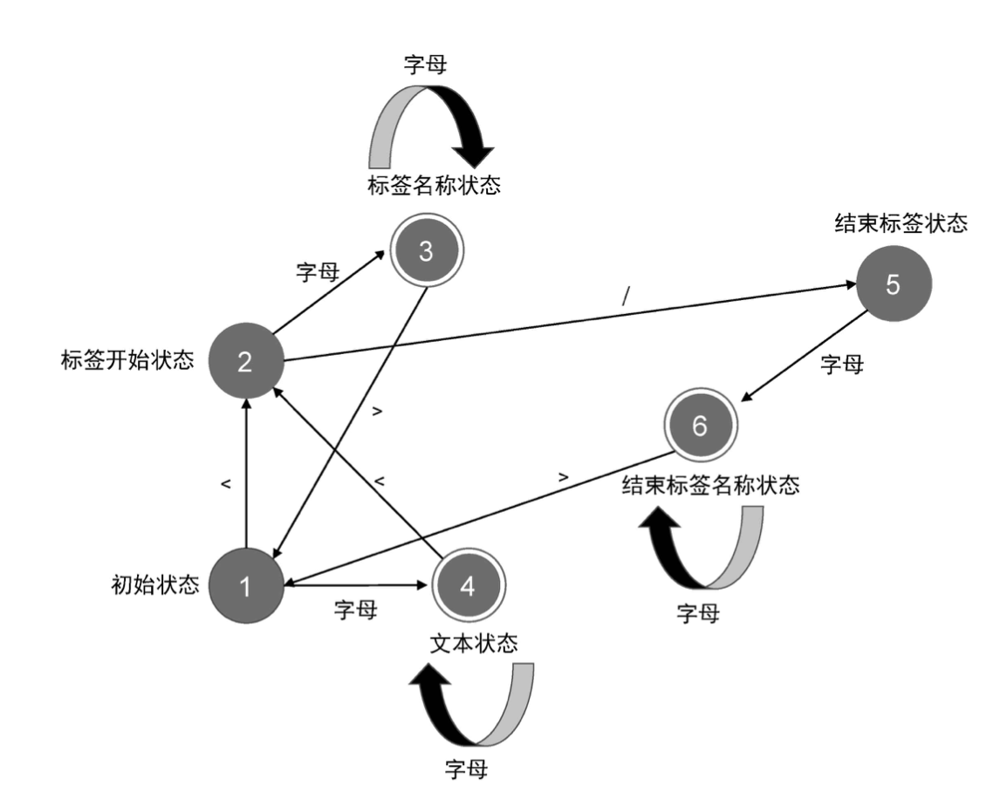

```javascript
// 状态机状态
const State = {
  // 初始状态
  initial: 1,
  // 标签开始状态
  tagOpen: 2,
  // 标签名称状态
  tagName: 3,
  // 文本状态
  text: 4,
  // 结束标签状态
  tagEnd: 5,
  // 结束标签名称状态
  tagEndName: 6
}

// 一个辅助函数，用于判断是否是字母
function isAlpha(char) {
  return char >= 'a' && char <= 'z' || char >= 'A' && char <= 'Z'
}

// 接收模板字符串作为参数，并将模板切割为 Token 返回
function tokenize(str) {
  // 状态机的当前状态:初始状态
  let currentState = State.initial
  // 用于缓存字符
  const chars = []
  // 生成的 Token 会存储到 tokens 数组中，并作为函数的返回值返回
  const tokens = []
  // 使用 while 循环开启自动机，只要模板字符串没有被消费尽，自动机就会一直运行
  while(str) {
    const char = str[0]
    // switch 语句匹配当前状态
    switch (currentState) {
      case State.initial:
        if (char === '<') {
          // 状态机切换到标签开始状态
          currentState = State.tagOpen
          // 消费字符 <
          str = str.slice(1)
        } else if (isAlpha(char)) {
          currentState = State.text
          chars.push(char)
          str = str.slice(1)
        }
        break
      case State.tagOpen:
        if (isAlpha(char)) {
          currentState = State.tagName
          chars.push(char)
          str = str.slice(1)
        } else if (char === '/') {
          currentState = State.tagEnd
          str = str.slice(1)
        }
        break
      case State.tagName:
        if (isAlpha(char)) {
          chars.push(char)
          str = str.slice(1)
        } else if (char === '>') {
          currentState = State.initial
          // 创建一个标签 Token，并添加到 tokens 数组中
          tokens.push({
            type: 'tag',
            name: chars.join('')
          })
          chars.length = 0
          str = str.slice(1)
        }
        break
      case State.text:
        if (isAlpha(char)) {
          chars.push(char)
          str = str.slice(1)
        } else if (char === '<') {
          currentState = State.tagOpen
          tokens.push({
            type: 'text',
            content: chars.join('')
          })
          chars.length = 0
          str = str.slice(1)
        }
        break
      case State.tagEnd:
        if (isAlpha(char)) {
          currentState = State.tagEndName
          chars.push(char)
          str = str.slice(1)
        }
        break
      case State.tagEndName:
        if (isAlpha(char)) {
          chars.push(char)
          str = str.slice(1)
        } else if (char === '>') {
          currentState = State.initial
          tokens.push({
            type: 'tagEnd',
            name: chars.join('')
          })
          chars.length = 0
          str = str.slice(1)
        }
        break
    }
  }

  return tokens
}
```

```javascript
const tokens = tokenize(`<div><p>Vue</p><p>Template</p></div>`)
[
  {type: "tag", name: "div"},
  {type: "tag", name: "p"},
  {type: "text", content: "Vue"},
  {type: "tagEnd", name: "p"},
  {type: "tag", name: "p"},
  {type: "text", content: "Template"},
  {type: "tagEnd", name: "p"},
  {type: "tagEnd", name: "div"}
]
```

#### 构造AST

为Vue.js的模板构造AST是一件很简单的事。HTML是一种标记语言，它的格式非常固定，标签元素之间天然嵌套，形成父子关系。因此，一棵用于描述HTML的AST将拥有与HTML标签非常相似的
树型结构。

根据Token列表构建AST的过程，其实就是对Token列表进行扫
描的过程。在这个过程中，我们需要维护一个栈elementStack，这个栈将用于维护元素间的父子关系。每遇到一个
开始标签节点，我们就构造一个Element类型的AST节点，并将其压入栈中。类似地，每当遇到一个结束标签节点，我们就将当前栈顶
的节点弹出。这样，栈顶的节点将始终充当父节点的角色。扫描过程
中遇到的所有节点，都会作为当前栈顶节点的子节点，并添加到栈顶
节点的children属性下。

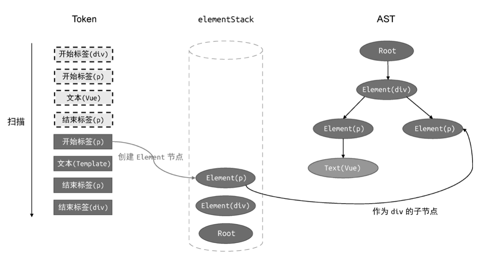

```javascript
function parse(str) {
  const tokens = tokenize(str)
  // 创建elementStack栈，起初只有Root根节点
  const root = {
    type: 'Root',
    children: []
  }
  const elementStack = [root]
  // 开启一个while循环扫描tokens，直到所有Token都被扫描完毕为止
  while (tokens.length) {
    const parent = elementStack[elementStack.length - 1]
    const t = tokens[0]
    switch (t.type) {
      case 'tag':
        // 如果当前Token是开始标签，则创建Element类型的AST节点
        const elementNode = {
          type: 'Element',
          tag: t.name,
          children: []
        }
        // 将其添加到父级节点的children中
        parent.children.push(elementNode)
        // 将当前节点压入栈
        elementStack.push(elementNode)
        break
      case 'text':
        const textNode = {
          type: 'Text',
          content: t.content
        }
        parent.children.push(textNode)
        break
      case 'tagEnd':
        // 遇到结束标签，将栈顶节点弹出
        elementStack.pop()
        break
    }
    // 消费已经扫描过的token
    tokens.shift()
  }

  return root
}
```

生成的模版AST如下

```javascript
const ast = {
  type: 'Root',
  children: [{
    type: 'Element',
    tag: 'div',
    children: [
      {
        type: 'Element',
        tag: 'p',
        children: [{
          type: 'Text',
          content: 'Vue'
        }]
      },
      {
        type: 'Element',
        tag: 'p',
        children: [{
          type: 'Text',
          content: 'Template'
        }]
      }
    ]
  }]
}
```

### 模版AST转换成JavaScript AST

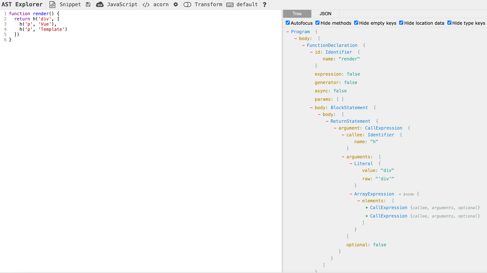

```javascript
// AST工具函数-start
function createStringLiteral(value) {
  return {
    type: 'StringLiteral',
    value
  }
}

function createIdentifier(name) {
  return {
    type: 'Identifier',
    name
  }
}

function createArrayExpression(elements) {
  return {
    type: 'ArrayExpression',
    elements
  }
}

function createCallExpression(callee, arguments) {
  return {
    type: 'CallExpression',
    callee: createIdentifier(callee),
    arguments
  }
}

function transformText(node) {
  if (node.type !== 'Text') {
    return
  }

  node.jsNode = createStringLiteral(node.content)
}


function transformElement(node) {

  return () => {
    if (node.type !== 'Element') {
      return
    }

    const callExp = createCallExpression('h', [
      createStringLiteral(node.tag)
    ])
    node.children.length === 1 ?
      callExp.arguments.push(node.children[0].jsNode) :
      callExp.arguments.push(
        createArrayExpression(node.children.map(c => c.jsNode))
      )

    node.jsNode = callExp
  }
}

function transformRoot(node) {
  return () => {
    if (node.type !== 'Root') {
      return
    }

    const vnodeJSAST = node.children[0].jsNode

    node.jsNode = {
      type: 'FunctionDecl',
      id: {
        type: 'Identifier',
        name: 'render'
      },
      params: [],
      body: [{
        type: 'ReturnStatement',
        return: vnodeJSAST
      }]
    }
  }
}
// AST工具函数-end

function traverseNode(ast, context) {
  context.currentNode = ast

  const exitFns = []
  const transforms = context.nodeTransforms
  for (let i = 0; i < transforms.length; i++) {
    const onExit = transforms[i](context.currentNode, context)
    if (onExit) {
      exitFns.push(onExit)
    }
    if (!context.currentNode) return
  }

  const children = context.currentNode.children
  if (children) {
    for (let i = 0; i < children.length; i++) {
      context.parent = context.currentNode
      context.childIndex = i
      traverseNode(children[i], context)
    }
  }

  let i = exitFns.length
  // 注意，这里我们要反序执行
  while (i--) {
    exitFns[i]()
  }
}


function transform(ast) {
  const context = {
    currentNode: null,
    parent: null,
    replaceNode(node) {
      context.currentNode = node
      context.parent.children[context.childIndex] = node
    },
    removeNode() {
      if (context.parent) {
        context.parent.children.splice(context.childIndex, 1)
        context.currentNode = null
      }
    },
    nodeTransforms: [
      transformRoot,
      transformElement,
      transformText
    ]
  }
  // 调用 traverseNode 完成转换
  traverseNode(ast, context)
}
```

### 生成代码

代码生成本质上是字符串拼接的艺术。我们需要访问JavaScript AST中的节点，为每一种类型的节点生成相符的JavaScript代码。

```javascript
function generate(node) {
  const context = {
    // 存储最终生成的渲染函数代码
    code: '',
    // 在生成代码时，通过调用 push 函数完成代码的拼接
    push(code) {
      context.code += code
    },
    // 当前缩进的级别，初始值为 0，即没有缩进
    currentIndent: 0,
    // 换行
    newline() {
      context.code += '\n' + `  `.repeat(context.currentIndent)
    },
    // 缩进
    indent() {
      context.currentIndent++
      context.newline()
    },
    // 取消缩进
    deIndent() {
      context.currentIndent--
      context.newline()
    }
  }
  // 调用 genNode 函数完成代码生成的工作
  genNode(node, context)
  // 返回渲染函数代码
  return context.code
}

function genNode(node, context) {
  switch (node.type) {
    case 'FunctionDecl':
      genFunctionDecl(node, context)
      break
    case 'ReturnStatement':
      genReturnStatement(node, context)
      break
    case 'CallExpression':
      genCallExpression(node, context)
      break
    case 'StringLiteral':
      genStringLiteral(node, context)
      break
    case 'ArrayExpression':
      genArrayExpression(node, context)
      break
  }
}

function genFunctionDecl(node, context) {
  const {
    push,
    indent,
    deIndent
  } = context

  push(`function ${node.id.name} `)
  push(`(`)
  genNodeList(node.params, context)
  push(`) `)
  push(`{`)
  indent()

  node.body.forEach(n => genNode(n, context))

  deIndent()
  push(`}`)
}

function genNodeList(nodes, context) {
  const {
    push
  } = context
  for (let i = 0; i < nodes.length; i++) {
    const node = nodes[i]
    genNode(node, context)
    if (i < nodes.length - 1) {
      push(', ')
    }
  }
}

function genReturnStatement(node, context) {
  const {
    push
  } = context

  push(`return `)
  genNode(node.return, context)
}

function genCallExpression(node, context) {
  const {
    push
  } = context
  const {
    callee,
    arguments: args
  } = node
  push(`${callee.name}(`)
  genNodeList(args, context)
  push(`)`)
}

function genStringLiteral(node, context) {
  const {
    push
  } = context

  push(`'${node.value}'`)
}

function genArrayExpression(node, context) {
  const {
    push
  } = context
  push('[')
  genNodeList(node.elements, context)
  push(']')
}
```

## 渲染器

渲染器是用来执行渲染任务的，在浏览器平台上，用它来渲染其中的真实DOM元素。渲染器不仅能够渲染真实 DOM 元素，它还是框架跨平台能力的关键。

在Vue.js中，很多功能依赖渲染器来实现，例如Transition组件、Teleport组件、Suspense组件，以及template ref和自定义指令等。渲染器也是框架性能的核心，渲染器的实现直接影响框架的性能。Vue.js 3 的渲染器不仅仅包含传统的 Diff 算法，它还独创了快捷路径的更新方式，能够充分利用编译器提供的信息，大大提升了更新性能。

### 一个简单的渲染器实现

```javascript
function createRenderer(options) {

  const {
    createElement,
    insert,
    setElementText
  } = options

  function mountElement(vnode, container) {
    const el = createElement(vnode.type)
    if (typeof vnode.children === 'string') {
      setElementText(el, vnode.children)
    }
    insert(el, container)
  }

  function patch(n1, n2, container) {
    if (!n1) {
      // 挂载
      mountElement(n2, container)
    } else {
      // 更新
    }
  }

  function render(vnode, container) {
    if (vnode) {
      // 新vnode存在，将其与旧vnode一起传递给patch函数进行打补丁
      patch(container._vnode, vnode, container)
    } else {
      if (container._vnode) {
        // 旧vnode存在，且新vnode不存在，说明是卸载(unmount)操作
        // 只需要将container内的DOM清空即可
        container.innerHTML = ''
      }
    }
    // 把vnode存储到container._vnode下，即后续渲染中的旧vnode
    container._vnode = vnode
  }
  
  return {
    render
  }
}

const vnode = {
  type: 'h1',
  children: 'hello'
}

const renderer = createRenderer({
  createElement(tag) {
    console.log(`创建元素 ${tag}`)
    return { tag }
  },
  setElementText(el, text) {
    console.log(`设置 ${JSON.stringify(el)} 的文本内容：${text}`)
    el.text = text
  },
  insert(el, parent, anchor = null) {
    console.log(`将 ${JSON.stringify(el)} 添加到 ${JSON.stringify(parent)} 下`)
    parent.children = el
  }
})

const container = { type: 'root' }
renderer.render(vnode, container)
```

### 挂载和更新

处理子节点，元素属性，class，点击事件

```javascript
function createRenderer(options) {

  const {
    createElement,
    insert,
    setElementText,
    patchProps,
    createText,
    setText
  } = options

  function mountElement(vnode, container) {
    const el = vnode.el = createElement(vnode.type)
    if (typeof vnode.children === 'string') {
      setElementText(el, vnode.children)
    } else if (Array.isArray(vnode.children)) {
      // patch子节点
      vnode.children.forEach(child => {
        patch(null, child, el)
      })
    }

    // 处理props
    if (vnode.props) {
      for (const key in vnode.props) {
        patchProps(el, key, null, vnode.props[key])
      }
    }

    insert(el, container)
  }

  // 更新子节点
  function patchChildren(n1, n2, container) {
    if (typeof n2.children === 'string') {
      if (Array.isArray(n1.children)) {
        n1.children.forEach((c) => unmount(c))
      }
      setElementText(container, n2.children)
    } else if (Array.isArray(n2.children)) {
      if (Array.isArray(n1.children)) {
        n1.children.forEach(c => unmount(c))
        n2.children.forEach(c => patch(null, c, container))
      } else {
        setElementText(container, '')
        n2.children.forEach(c => patch(null, c, container))
      }
    } else {
      if (Array.isArray(n1.children)) {
        n1.children.forEach(c => unmount(c))
      } else if (typeof n1.children === 'string') {
        setElementText(container, '')
      }
    }
  }

  function patchElement(n1, n2) {
    const el = n2.el = n1.el
    const oldProps = n1.props
    const newProps = n2.props
    
    for (const key in newProps) {
      if (newProps[key] !== oldProps[key]) {
        patchProps(el, key, oldProps[key], newProps[key])
      }
    }
    for (const key in oldProps) {
      if (!(key in newProps)) {
        patchProps(el, key, oldProps[key], null)
      }
    }

    patchChildren(n1, n2, el)
  }

  function unmount(vnode) {
    if (vnode.type === Fragment) {
      vnode.children.forEach(c => unmount(c))
      return
    }
    const parent = vnode.el.parentNode
    if (parent) {
      parent.removeChild(vnode.el)
    }
  }

  function patch(n1, n2, container) {
   // 如果新旧vnode的类型不同，则直接将旧vnode卸载
    if (n1 && n1.type !== n2.type) {
      unmount(n1)
      n1 = null
    }

    const { type } = n2

    if (typeof type === 'string') {
      if (!n1) {
        // 挂载
        mountElement(n2, container)
      } else {
        // 更新
        patchElement(n1, n2)
      }
    } else if (type === Text) {
      // 文本节点
      if (!n1) {
        const el = n2.el = createText(n2.children)
        insert(el, container)
      } else {
        const el = n2.el = n1.el
        if (n2.children !== n1.children) {
          setText(el, n2.children)
        }
      }
    } else if (type === Fragment) {
      // Fragment节点
      if (!n1) {
        n2.children.forEach(c => patch(null, c, container))
      } else {
        patchChildren(n1, n2, container)
      }
    }
  }

  function render(vnode, container) {
    if (vnode) {
      // 新vnode存在，将其与旧vnode一起传递给patch函数进行打补丁
      // 挂载是一种旧vnode为node的patch
      patch(container._vnode, vnode, container)
    } else {
      if (container._vnode) {
        // 旧vnode存在，且新vnode不存在，说明是卸载(unmount)操作
        unmount(container._vnode)
      }
    }
    // 把vnode存储到container._vnode下，即后续渲染中的旧vnode
    container._vnode = vnode
  }
  
  return {
    render
  }
}
```

```javascript
patchProps(el, key, prevValue, nextValue) {
  if (/^on/.test(key)) {
    // 处理点击事件
    const invokers = el._vei || (el._vei = {})
    let invoker = invokers[key]
    const name = key.slice(2).toLowerCase()
    if (nextValue) {
      if (!invoker) {
        invoker = el._vei[key] = (e) => {
          console.log(e.timeStamp)
          console.log(invoker.attached)
          if (e.timeStamp < invoker.attached) return
          if (Array.isArray(invoker.value)) {
            invoker.value.forEach(fn => fn(e))
          } else {
            invoker.value(e)
          }
        }
        invoker.value = nextValue
        invoker.attached = performance.now()
        el.addEventListener(name, invoker)
      } else {
        invoker.value = nextValue
      }
    } else if (invoker) {
      el.removeEventListener(name, invoker)
    }
  } else if (key === 'class') {
    // 处理cLass
    el.className = nextValue || ''
  } else if (shouldSetAsProps(el, key, nextValue)) {
    // 设置元素属性
    // 无论是使用setAttribute函数，还是直接设置元素的DOM Properties都存在缺陷
    const type = typeof el[key]
    if (type === 'boolean' && nextValue === '') {
      el[key] = true
    } else {
      el[key] = nextValue
    }
  } else {
    el.setAttribute(key, nextValue)
  }
}

function shouldSetAsProps(el, key, value) {
  if (key === 'form' && el.tagName === 'INPUT') return false
  return key in el
}
```

### diff算法

当新旧vnode的子节点都是一组节点时，为了以最小的性能开销完成更新操作，需要比较两组子节点，用于比较的算法就叫作Diff算法。

- 找出可以复用的节点
- 移动，添加，删除虚拟节点对应的dom元素

#### key属性和DOM复用

为了找出哪些节点可以复用给vnode添加key属性

```javascript
const newVnode = {
  type: 'div',
  children: [
    { type: 'p', children: '1', key: 1 },
    { type: 'p', children: '2', key: 2 },
    { type: 'p', children: 'hello', key: 3 }
  ]
}

const oldVnode = {
  type: 'div',
  children: [
    { type: 'p', children: 'world', key: 3 },
    { type: 'p', children: '1', key: 1 },
    { type: 'p', children: '2', key: 2 }
  ]
}
```

#### 简单diff算法

简单Diff算法的核心逻辑是，拿新的一组子节点中的节点去旧的一组子节点中寻找可复用的节点。如果找到了，则记录该节点的位置索引。我们把这个位置索引称为最大索引。在整个更新过程中，如果一个节点的索引值小于最大索引，则说明该节点对应的真实DOM元素需要移动

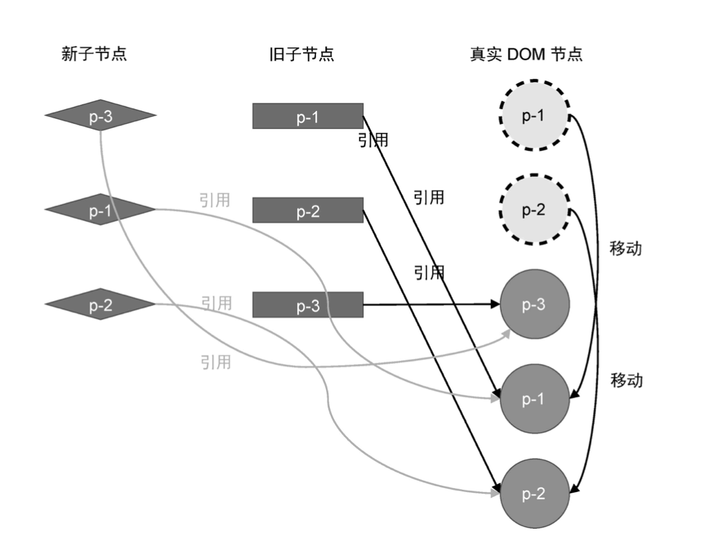

```javascript
function patchChildren(n1, n2, container) {
  if (typeof n2.children === 'string') {
    if (Array.isArray(n1.children)) {
      n1.children.forEach((c) => unmount(c))
    }
    setElementText(container, n2.children)
  } else if (Array.isArray(n2.children)) {
    const oldChildren = n1.children
    const newChildren = n2.children

    let lastIndex = 0
    // 遍历新的children
    for (let i = 0; i < newChildren.length; i++) {
      const newVNode = newChildren[i]
      let j = 0
      // 遍历旧的children
      for (j; j < oldChildren.length; j++) {
        const oldVNode = oldChildren[j]
        // 如果找到了具有相同key值的两个节点，则调用 `patch` 函数更新之
        if (newVNode.key === oldVNode.key) {
          patch(oldVNode, newVNode, container)
          if (j < lastIndex) {
            // 需要移动
            const prevVNode = newChildren[i - 1]
            if (prevVNode) {
              const anchor = prevVNode.el.nextSibling
              insert(newVNode.el, container, anchor)
            }
          } else {
            // 更新lastIndex
            lastIndex = j
          }
          break // 这里需要break
        }
      }
    }

  } else {
    if (Array.isArray(n1.children)) {
      n1.children.forEach(c => unmount(c))
    } else if (typeof n1.children === 'string') {
      setElementText(container, '')
    }
  }
}
```

#### 双端diff算法

双端Diff算法指的是，在新旧两组子节点的四个端点之间分别进行比较，并试图找到可复用的节点。相比简单Diff算法，双端Diff算法的优势在于，对于同样的更新场景，执行的DOM移动操作次数更少。

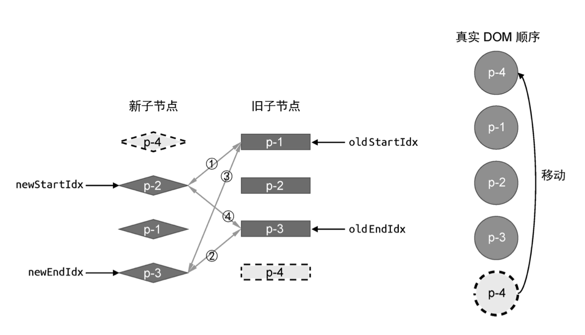

[双端diff算法动画演示](https://wanglin2.github.io/VNode_visualization_demo/)

```javascript
function patchKeyedChildren(n1, n2, container) {
  const oldChildren = n1.children
  const newChildren = n2.children

  let oldStartIdx = 0
  let oldEndIdx = oldChildren.length - 1
  let newStartIdx = 0
  let newEndIdx = newChildren.length - 1

  let oldStartVNode = oldChildren[oldStartIdx]
  let oldEndVNode = oldChildren[oldEndIdx]
  let newStartVNode = newChildren[newStartIdx]
  let newEndVNode = newChildren[newEndIdx]

  while (oldStartIdx <= oldEndIdx && newStartIdx <= newEndIdx) {
    if (!oldStartVNode) {
      oldStartVNode = oldChildren[++oldStartIdx]
    } else if (!oldEndVNode) {
      oldEndVNode = newChildren[--oldEndIdx]
    } else if (oldStartVNode.key === newStartVNode.key) {
      patch(oldStartVNode, newStartVNode, container)
      oldStartVNode = oldChildren[++oldStartIdx]
      newStartVNode = newChildren[++newStartIdx]
    } else if (oldEndVNode.key === newEndVNode.key) {
      patch(oldEndVNode, newEndVNode, container)
      oldEndVNode = oldChildren[--oldEndIdx]
      newEndVNode = newChildren[--newEndIdx]
    } else if (oldStartVNode.key === newEndVNode.key) {
      patch(oldStartVNode, newEndVNode, container)
      insert(oldStartVNode.el, container, newEndVNode.el.nextSibling)

      oldStartVNode = oldChildren[++oldStartIdx]
      newEndVNode = newChildren[--newEndIdx]
    } else if (oldEndVNode.key === newStartVNode.key) {
      // 步骤四：oldEndVNode 和 newStartVNode 比对
      patch(oldEndVNode, newStartVNode, container)
      insert(oldEndVNode.el, container, oldStartVNode.el)

      oldEndVNode = oldChildren[--oldEndIdx]
      newStartVNode = newChildren[++newStartIdx]
    } else {
      // 遍历旧 children，试图寻找与 newStartVNode 拥有相同 key 值的元素
      const idxInOld = oldChildren.findIndex(
        node => node.key === newStartVNode.key
      )
      if (idxInOld > 0) {
        const vnodeToMove = oldChildren[idxInOld]
        patch(vnodeToMove, newStartVNode, container)
        insert(vnodeToMove.el, container, oldStartVNode.el)
        oldChildren[idxInOld] = undefined
        newStartVNode = newChildren[++newStartIdx]
      }
    }
  }
}
```

#### 快速diff算法

快速Diff算法在实测中性能最优。它借鉴了文本Diff中的预处理思路，先处理新旧两组子节点中相同的前置节点和相同的后置节点。
当前置节点和后置节点全部处理完毕后，如果无法简单地通过挂载新节点或者卸载已经不存在的节点来完成更新，则需要根据节点的索引关系，构造出一个最长递增子序列。最长递增子序列所指向的节点即为不需要移动的节点。

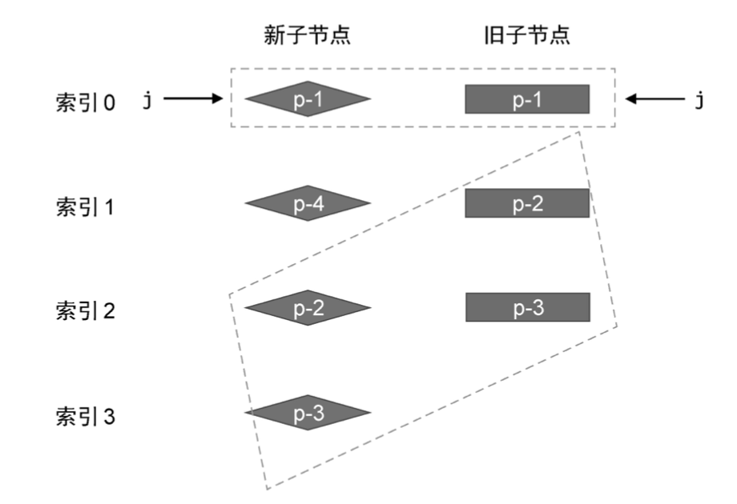

```javascript
function patchKeyedChildren(n1, n2, container) {
  const newChildren = n2.children
  const oldChildren = n1.children
  // 更新相同的前缀节点
  // 索引 j 指向新旧两组子节点的开头
  let j = 0
  let oldVNode = oldChildren[j]
  let newVNode = newChildren[j]
  // while 循环向后遍历，直到遇到拥有不同 key 值的节点为止
  while (oldVNode.key === newVNode.key) {
    // 调用 patch 函数更新
    patch(oldVNode, newVNode, container)
    j++
    oldVNode = oldChildren[j]
    newVNode = newChildren[j]
  }

  // 更新相同的后缀节点
  // 索引 oldEnd 指向旧的一组子节点的最后一个节点
  let oldEnd = oldChildren.length - 1
  // 索引 newEnd 指向新的一组子节点的最后一个节点
  let newEnd = newChildren.length - 1

  oldVNode = oldChildren[oldEnd]
  newVNode = newChildren[newEnd]

  // while 循环向前遍历，直到遇到拥有不同 key 值的节点为止
  while (oldVNode.key === newVNode.key) {
    // 调用 patch 函数更新
    patch(oldVNode, newVNode, container)
    oldEnd--
    newEnd--
    oldVNode = oldChildren[oldEnd]
    newVNode = newChildren[newEnd]
  }

  // 满足条件，则说明从 j -> newEnd 之间的节点应作为新节点插入
  if (j > oldEnd && j <= newEnd) {
    // 锚点的索引
    const anchorIndex = newEnd + 1
    // 锚点元素
    const anchor = anchorIndex < newChildren.length ? newChildren[anchorIndex].el : null
    // 采用 while 循环，调用 patch 函数逐个挂载新增的节点
    while (j <= newEnd) {
      patch(null, newChildren[j++], container, anchor)
    }
  } else if (j > newEnd && j <= oldEnd) {
    // j -> oldEnd 之间的节点应该被卸载
    while (j <= oldEnd) {
      unmount(oldChildren[j++])
    }
  } else {
    // 构造 source 数组
    const count = newEnd - j + 1 // 新的一组子节点中剩余未处理节点的数量
    const source = new Array(count)
    source.fill(-1)

    const oldStart = j
    const newStart = j
    let moved = false
    let pos = 0
    const keyIndex = {}
    for (let i = newStart; i <= newEnd; i++) {
      keyIndex[newChildren[i].key] = i
    }
    let patched = 0
    for (let i = oldStart; i <= oldEnd; i++) {
      oldVNode = oldChildren[i]
      if (patched < count) {
        const k = keyIndex[oldVNode.key]
        if (typeof k !== 'undefined') {
          newVNode = newChildren[k]
          patch(oldVNode, newVNode, container)
          patched++
          source[k - newStart] = i
          // 判断是否需要移动
          if (k < pos) {
            moved = true
          } else {
            pos = k
          }
        } else {
          // 没找到
          unmount(oldVNode)
        }
      } else {
        unmount(oldVNode)
      }
    }

    if (moved) {
      const seq = lis(source)
      // s 指向最长递增子序列的最后一个值
      let s = seq.length - 1
      let i = count - 1
      for (i; i >= 0; i--) {
        if (source[i] === -1) {
          // 说明索引为 i 的节点是全新的节点，应该将其挂载
          // 该节点在新 children 中的真实位置索引
          const pos = i + newStart
          const newVNode = newChildren[pos]
          // 该节点下一个节点的位置索引
          const nextPos = pos + 1
          // 锚点
          const anchor = nextPos < newChildren.length ?
            newChildren[nextPos].el :
            null
          // 挂载
          patch(null, newVNode, container, anchor)
        } else if (i !== seq[j]) {
          // 说明该节点需要移动
          // 该节点在新的一组子节点中的真实位置索引
          const pos = i + newStart
          const newVNode = newChildren[pos]
          // 该节点下一个节点的位置索引
          const nextPos = pos + 1
          // 锚点
          const anchor = nextPos < newChildren.length ?
            newChildren[nextPos].el :
            null
          // 移动
          insert(newVNode.el, container, anchor)
        } else {
          // 当 i === seq[j] 时，说明该位置的节点不需要移动
          // 并让 s 指向下一个位置
          s--
        }
      }
    }
  }
}
```

## 组件化

从渲染器的实现来看，组件是一个特殊类型的虚拟DOM，使用虚拟节点的vnode.type属性来存储组件对象，渲染器根据虚拟节点的该属性的类型来判断它是否是组件。如果是组件，则渲染器会使用mountComponent 和 patchComponent 来完成组件的挂载和更新。

```javascript
// 该vnode用来描述组件，type属性存储组件的选项对象
const vnode = {
  type: MyComponent
  // ...
}

function patch(n1, n2, container, anchor) {
  if (typeof type === 'string') {
    // ...
  } else if (type === Text) {
    // ...
  } else if (type === Fragment) {
    // ...
  } else if (typeof type === 'object' || typeof type === 'function') {
    // component
    if (!n1) {
      // 渲染组件
      mountComponent(n2, container, anchor)
    } else {
      // 更新组件
      patchComponent(n1, n2, anchor)
    }
  }
}
```

### 渲染组件

处理组件生命周期函数，data，props，slots，emit，setup

```javascript
function mountComponent(vnode, container, anchor) {
  const isFunctional = typeof vnode.type === 'function'

  // 组件对象
  let componentOptions = vnode.type

  if (isFunctional) {
    componentOptions = {
      render: vnode.type,
      props: vnode.type.props
    }
  }
  let {
    render,
    data,
    setup,
    beforeCreate,
    created,
    beforeMount,
    mounted,
    beforeUpdate,
    updated,
    props: propsOption
  } = componentOptions

  // 调用声明周期钩子函数
  beforeCreate && beforeCreate()

  // 调用data函数得到原始数据，并调用reactive函数将其包装为响应式数据
  const state = data ? reactive(data()) : null

  // propsOption组件对象中定义的props
  // vnode.props，给组件传递的props
  // 调用resolveProps函数解析出最终的props数据与attrs数据
  const [props, attrs] = resolveProps(propsOption, vnode.props)

  // 直接使用编译好的vnode.children对象作为slots对象即可
  const slots = vnode.children || {}

  // 组件实例
  const instance = {
    // 组件的自身状态数据，data
    state,
    // 将解析出的props数据包装为shallowReactive并定义到组件实例上
    props: shallowReactive(props),
    // 组件是否已挂载
    isMounted: false,
    // 组件所渲染的内容
    subTree: null,
    // 将插槽添加到组件实例上
    slots,
    // 在组件实例中添加mounted数组，用来存储通过onMounted函数注册的生命周期钩子函数
    mounted: []
  }

  // 封装emit函数
  function emit(event, ...payload) {
    // 根据约定对事件名称进行处理，例如 change --> onChange
    const eventName = `on${event[0].toUpperCase() + event.slice(1)}`
    // 根据处理后的事件名称去props中寻找对应的事件处理函数
    const handler = instance.props[eventName]
    if (handler) {
      // 调用事件处理函数并传递参数
      handler(...payload)
    } else {
      console.error('事件不存在')
    }
  }

  // setup
  // setupState用来存储由setup返回的数据
  let setupState = null
  if (setup) {

    const setupContext = {
      attrs,
      emit,
      slots
    }

    const prevInstance = setCurrentInstance(instance)

    // 调用setup函数
    const setupResult = setup(shallowReadonly(instance.props), setupContext)

    setCurrentInstance(prevInstance)
    if (typeof setupResult === 'function') {
      if (render) console.error('setup 函数返回渲染函数，render 选项将被忽略')
      render = setupResult
    } else {
      // 如果setup的返回值不是函数，则作为数据状态赋值给setupState
      setupState = setupContext
    }
  }

  vnode.component = instance

  // 渲染上下文对象，本质上是组件实例的代理
  // 把props数据与组件自身的状态数据暴露到渲染函数中，并使得渲染函数能够通过this访问它们
  const renderContext = new Proxy(instance, {
    get(t, k, r) {
      const {
        state,
        props,
        slots
      } = t

      if (k === '$slots') return slots

      if (state && k in state) {
        return state[k]
      } else if (k in props) {
        return props[k]
      } else if (setupState && k in setupState) {
        return setupState[k]
      } else {
        console.error('不存在')
      }
    },
    set(t, k, v, r) {
      const {
        state,
        props
      } = t
      if (state && k in state) {
        state[k] = v
      } else if (k in props) {
        props[k] = v
      } else if (setupState && k in setupState) {
        setupState[k] = v
      } else {
        console.error('不存在')
      }
    }
  })

  // 调用声明周期钩子函数
  created && created.call(renderContext)
  // 将组件的render函数调用包装到effect内
  // 一旦组件自身的响应式数据发生变化，组件就会自动重新执行渲染函数，从而完成更新
  effect(() => {
    const subTree = render.call(renderContext, renderContext)
    if (!instance.isMounted) {
      // 调用声明周期钩子函数
      beforeMount && beforeMount.call(renderContext)
      patch(null, subTree, container, anchor)
      instance.isMounted = true
      // 调用声明周期钩子函数
      mounted && mounted.call(renderContext)
      // 遍历instance.mounted并逐个执行
      instance.mounted && instance.mounted.forEach(hook => hook.call(renderContext))
    } else {
      // 调用声明周期钩子函数
      beforeUpdate && beforeUpdate.call(renderContext)
      patch(instance.subTree, subTree, container, anchor)
      updated && updated.call(renderContext)
    }
    instance.subTree = subTree
  }, {
    scheduler: queueJob
  })
}
```

### 更新组件

#### 自动更新

组件自身的响应式数据发生变化，组件就会自动重新 执行渲染函数，从而完成更新
由于effect的执行是同步的，因此当响应式数据发生变化时，与之关联的副作用函数会同步执行。换句话说，如果多次修改响应式数据的值，将会导致渲染函数执行多次，这实际上是没有必要的。因此，我们需要设计一个机制，以使得无论对响应式数据进行多少次修改，副作用函数都只会重新执行一次。为此，我们需要实现一个调度器，当副作用函数需要重新执行时，我们不会立即执行它，而是将它缓冲到一个微任务队列中，等到执行栈清空后，再将它从微任务队列中取出并执行

```javascript
// 创建一个立即resolve的Promise 实例
const p = Promise.resolve()
// 任务缓存队列，用一个Set数据结构来表示，这样就可以自动对任务进行去重
const queue = new Set()
// 一个标志，代表是否正在刷新任务队列
let isFlushing = false
// 调度器的主要函数，用来将一个任务添加到缓冲队列中，并开始刷新队列
function queueJob(job) {
  queue.add(job)
  if (!isFlushing) {
    isFlushing = true
    // 在微任务中刷新缓冲队列
    p.then(() => {
      try {
        queue.forEach(jon => job())
      } finally {
        isFlushing = false
      }
    })
  }
}

// 将组件的render函数调用包装到effect内
// 一旦组件自身的响应式数据发生变化，组件就会自动重新执行渲染函数，从而完成更新
effect(() => {
  const subTree = render.call(renderContext, renderContext)
  if (!instance.isMounted) {
    // 调用声明周期钩子函数
    beforeMount && beforeMount.call(renderContext)
    patch(null, subTree, container, anchor)
    instance.isMounted = true
    // 调用声明周期钩子函数
    mounted && mounted.call(renderContext)
    // 遍历instance.mounted并逐个执行
    instance.mounted && instance.mounted.forEach(hook => hook.call(renderContext))
  } else {
    // 调用声明周期钩子函数
    beforeUpdate && beforeUpdate.call(renderContext)
    patch(instance.subTree, subTree, container, anchor)
    updated && updated.call(renderContext)
  }
  instance.subTree = subTree
}, {
  scheduler: queueJob
})
```

被动更新

我们把由父组件自更新所引起的子组件更新叫作子组件的被动更新

- 检测子组件是否真的需要更新，因为子组件的 props 可能是不变 的
- 如果需要更新，则更新子组件的 props、slots 等内容

```javascript
function patchComponent(n1, n2, anchor) {
  const instance = (n2.component = n1.component)
  const {
    props
  } = instance
  // 调用hasPropsChanged检测为子组件传递的props是否发生变化，如果没有变化，则不需要更新
  if (hasPropsChanged(n1.props, n2.props)) {
    const [nextProps, nextAttrs] = resolveProps(n2.type.props, n2.props)
    // 更新props
    for (const k in nextProps) {
      props[k] = nextProps[k]
    }
    // 删除不存在的props
    for (const k in props) {
      if (!(k in nextProps)) delete props[k]
    }
  }
}

function hasPropsChanged(
  prevProps,
  nextProps
) {
  const nextKeys = Object.keys(nextProps)
  // 如果新旧props的数量变了，则说明有变化
  if (nextKeys.length !== Object.keys(prevProps).length) {
    return true
  }
  for (let i = 0; i < nextKeys.length; i++) {
    const key = nextKeys[i]
    // 有不相等的 props，则说明有变化
    return nextProps[key] !== prevProps[key]
  }
  return false
}
```
