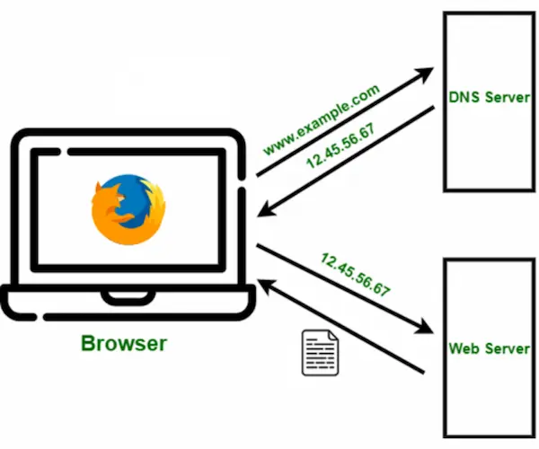

#### 从输入URL到页面加载发生了什么

- URL解析
- DNS查询
- TCP连接
- 处理请求
- 接受响应
- 释放TCP连接
- 渲染页面

**渲染页面流程**

- 构建 DOM 树
  当解析器发现非阻塞资源，例如一张图片，浏览器会请求这些资源并且继续解析。当遇到一个 CSS 文件时，解析也可以继续进行，但是对于script标签（特别是没有 async 或者 defer 属性的）会阻塞渲染并停止 HTML 的解析。尽管浏览器的预加载扫描器加速了这个过程，但过多的脚本仍然是一个重要的瓶颈

- 构建 CSSOM 树
  
- JavaScript 编译
  JavaScript 被解释、编译、解析和执行

- Style
  将 DOM 和 CSSOM 组合成一个 Render 树，计算样式树或渲染树从 DOM 树的根开始构建，遍历每个可见节点

- layout
  渲染树上运行布局以计算每个节点的几何体。布局是确定呈现树中所有节点的宽度、高度和位置，以及确定页面上每个对象的大小和位置的过程。回流是对页面的任何部分或整个文档的任何后续大小和位置的确定

- 绘制
  最后一步是将各个节点绘制到屏幕上    

 

#### DOM API
- document.getElementById 根据id获取元素
- document.getElementByName 根据name获取元素
- document.getElementByClassName 根据类名获取元素
- document.querySelector 根据选择器获取元素
- document.querySelectorAll 根据选择器获取元素
- document.createElement 创建元素节点
 

#### 函数的防抖与节流

函数防抖和函数节流都是防止某一时间频繁触发

- 防抖是间隔某一段时间后执行
- 节流是单位时间内之触发一次

 

**参考**
[DNS 查询原理详解](https://www.ruanyifeng.com/blog/2022/08/dns-query.html)
[How_browsers_work](https://developer.mozilla.org/zh-CN/docs/Web/Performance/How_browsers_work)