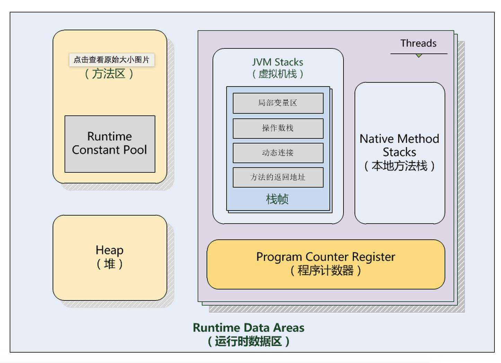

## java虚拟机

#### 1 虚拟机

虚拟机（virtual machine），在计算机科学的体系结构里，是指一种特殊的软件，可以在计算机平台和终端用户之间创建一种环境，而终端用户则基于虚拟机这个软件所创建的环境来操作其他软件，是对计算机系统的抽象。

- **系统虚拟机**
  例如：VirtualBox
   

- **程序虚拟机**
  例如：java虚拟机
   

- **操作系统层虚拟机**
  例如：Docker
   

#### 2 java虚拟机

java虚拟机（java virtual machine JVM），一种能够执行java字节码的虚拟机，是对计算机系统的抽象，屏蔽了与具体操作系统平台的相关信息

#### 3 java虚拟机运行时数据区

线程隔离数据区（ 程序计数器 虚拟机栈 本地方法栈 ） 线程共享数据区（ 方法区 java堆 ）

- **程序计数器**
  一小块内存区域 当前线程所执行的字节码的行号指示器
   

- **虚拟机栈**
  java方法执行的内存模型 每个方法被执行时会创建一个栈帧（ 局部变量表 操作栈 动态链接 方法出口 ），每一个方法从调用到完成对应一个栈帧在虚拟机栈中从入栈到出栈的过程
   

- **本地方法栈**
  和虚拟机栈非常相似 为虚拟机执行的Native方法服务
   

- **方法区**
  存储虚拟机加载的类信息 常量 静态变量 （ 常量池 ）
   

- **java堆**
  Java Heap 是java虚拟机中管理的最大的一块内存空间 用来存放对象实例 几乎所有的对象实例都在这里分配
  Java Heap 是GC回收的的主要区域，如果堆内没有内存完成实例分配并切堆也无法扩展时将抛出OutOfMemoryError      
   

#### 4 垃圾回收
哪些内存需要回收？ 什么时候回收？ 如何回收？
排查内存溢出和内存泄露时需要对垃圾回收进行监控和调节

**哪些内存需要回收**
- 引用计数法
  给对象添加一个引用计数器 引用+1 引用失效-1 很难解决对象间相互循环引用的问题
- 可达性分析法（ 根搜索算法 ）
  通过GCRoots对象为起始点往下搜索 当一个对象到GCRoots对象间没有任何引用链的时候（ 不可达 ）判断为可回收对象

**GCRoots对象**

- 虚拟机栈（ 栈帧中本地变量表 ）中引用的对象
- 方法区中常量引用的对象
- 方法区中类静态属性引用的对象
- 本地方法栈中native方法引用的对象 

**引用类型**
- 强引用 
  垃圾回收永远不会回收强引用的对象
- 软引用 
  有用但非必须的对象 在系统发生内存溢出之前 将会回收这类对象
- 弱引用 
  比弱引用更弱一点 当发生垃圾回收时会回收掉弱引用关联的对象（ 无论内存是否足够 ）
- 虚引用 
  是最弱的一种引用 一个对象是否有虚引用存在完全不会对其生存空间造成影响 目的垃圾回收时收到通知

**如何回收？**

- 标记-清除算法 
  首先标记出所有需要回收的对象 在标记完成后回收所有被标记的对象 缺点 空间问题 标记清除后会产生大量不连续的内存碎片，后果是当需要较大连续内存时再触发一次收集过程

- 复制算法    
  将可用内存分为大小相等的两块 每次只使用其中一块 当一块内存用完了就将还存活的对象复制到另一块上 然后再把已使用的一块的内存空间一次清理掉代价是将内存缩小为原来的一半

- 标记-整理算法 
  标记后让所有存活的对象都向一端移动 然后直接清理掉端边界以外的内存

- 分代收集算法  
  把java堆分为新生代（ 存活量少 ）和老年代（ 存活量高 ） 新生代采用复制算法（8：1）老年代采用 标记-清理或标记-整理算法

**内存分配策略**
对象优先在新生代Eden分配 没有足够空间时发起Minor GC
大对象（ 大量连续内存空间的Java对象 如数组 ）直接进入老年代
长期存活的对象将进入老年代（ 对象年龄计数器 ）

**Class文件 ByteCode**
Class文件是一组以8位字节为基础单位的二进制流

**类加载器**
双亲委派模型 Parents Delegation Moudel