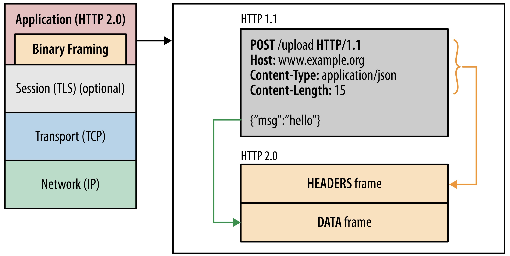
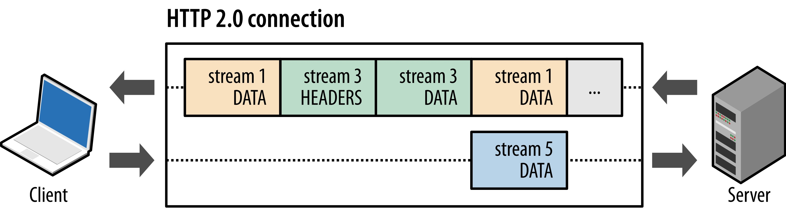
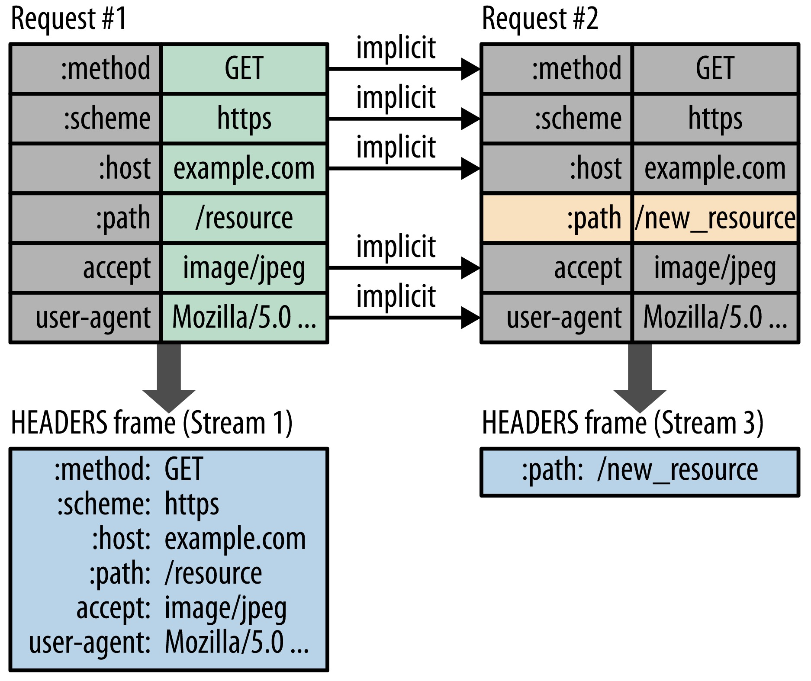
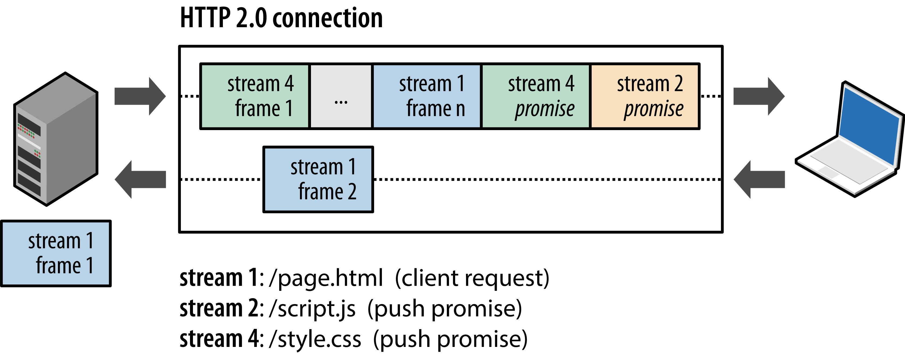

#### 加密

**对称加密**

**非对称加密**

非对称加密的安全性比对称加密要高，但是它需要更多的计算，不适用于数据量大的场景，通信速度没有了保证也不行的，TLS 加密算法并没有完全采用这种加密算法。
 

**加密算法**
- RSA
  1977年，三位数学家Rivest、Shamir 和 Adleman 设计了一种算法，可以实现非对称加密。这种算法用他们三个人的名字命名，叫做RSA算法。从那时直到现在，RSA算法一直是最广为使用的"非对称加密算法"。毫不夸张地说，只要有计算机网络的地方，就有RSA算法。
 

- 3DES
三重数据加密算法（英语：Triple Data Encryption Algorithm，缩写为TDEA，Triple DEA），或称3DES（Triple DES），是一种对称密钥加密块密码，相当于是对每个数据块应用三次资料加密标准（DES）算法
 

#### HTTP响应状态码

- 200 
  成功
   

- 206 
  断点续传，当从客户端发送Range范围标头以只请求资源的一部分时，将使用此响应代码
  

- 304
  这是用于缓存的目的。它告诉客户端响应还没有被修改，因此客户端可以继续使用相同的缓存版本的响应
   

- 403
  客户端没有访问内容的权限；也就是说，它是未经授权的，因此服务器拒绝提供请求的资源。与 401 Unauthorized 不同，服务器知道客户端的身份  
   

- 404 
  服务器找不到请求的资源
   

- 500
  服务器错误，服务器遇到了不知道如何处理的情况
   

- 502
  Bad Gateway，此错误响应表明服务器作为网关需要得到一个处理这个请求的响应，但是得到一个错误的响应
   

- 504
  当服务器充当网关且无法及时获得响应时，会给出此错误响应 
     

#### HTTPS

#### TCP连接

**三次握手**

为什么TCP客户端最后还要发送一次确认呢？
> 通过三次握手才能阻止重复历史连接的初始化

> 一句话，主要防止已经失效的连接请求报文突然又传送到了服务器，从而产生错误。
如果使用的是两次握手建立连接，假设有这样一种场景，客户端发送了第一个请求连接并且没有丢失，只是因为在网络结点中滞留的时间太长了，由于TCP的客户端迟迟没有收到确认报文，以为服务器没有收到，此时重新向服务器发送这条报文，此后客户端和服务器经过两次握手完成连接，传输数据，然后关闭连接。此时此前滞留的那一次请求连接，网络通畅了到达了服务器，这个报文本该是失效的，但是，两次握手的机制将会让客户端和服务器再次建立连接，这将导致不必要的错误和资源的浪费。
如果采用的是三次握手，就算是那一次失效的报文传送过来了，服务端接受到了那条失效报文并且回复了确认报文，但是客户端不会再次发出确认。由于服务器收不到确认，就知道客户端并没有请求连接。

 

#### HTTP2

**二进制分帧**
HTTP/2没有改动HTTP的应用语义，仍然使用HTTP的请求方法、状态码和头字段等规则，它主要修改了HTTP的报文传输格式。HTTP/1.1协议以换行符作为纯文本的分隔符，而HTTP/2将所有传输的信息分割为更小的消息和帧，并采用二进制格式对它们编码，这些帧对应着特定数据流中的消息，他们都在一个TCP连接内复用HTTP/2没有改动HTTP的应用语义，仍然使用HTTP的请求方法、状态码和头字段等规则，它主要修改了HTTP的报文传输格式。HTTP/1.1协议以换行符作为纯文本的分隔符，而HTTP/2将所有传输的信息分割为更小的消息和帧，并采用二进制格式对它们编码，这些帧对应着特定数据流中的消息，他们都在一个TCP连接内复用

**多路复用**

多路复用允许同时通过单一的HTTP/2连接发起多重的请求-响应消息，实现多流并行而并不依赖多个TCP连接，HTTP/2把HTTP协议通信的基本单位缩小为一个一个的帧，这些帧对应着逻辑流中的消息，并行地在同一个TCP连接上双向交换消息

**头部压缩**
http1.x的头带有大量信息，而且每次都要重复发送。http/2使用encoder来减少需要传输的header大小，通讯双方各自缓存一份头部字段表，既避免了重复header的传输，又减小了需要传输的大小。

**服务端推送**

HTTP2.0的一个强大的新功能，就是服务器可以对一个客户端请求发送多个响应。服务器向客户端推送资源无需客户端明确的请求。服务端根据客户端的请求，提前返回多个响应，推送额外的资源给客户端

#### 缓存
- 强缓存
- 协商缓存
  ETAG

 

**参考**

[Introduction to HTTP/2](https://web.dev/performance-http2/#_8)
[深入理解http2.0协议，看这篇就够了](https://juejin.cn/post/6844903984524705800)
[什么是HTTP/2](https://info.support.huawei.com/info-finder/encyclopedia/zh/HTTP--2.html)
[浏览器缓存知识梳理
](https://juejin.cn/post/6947936223126093861)